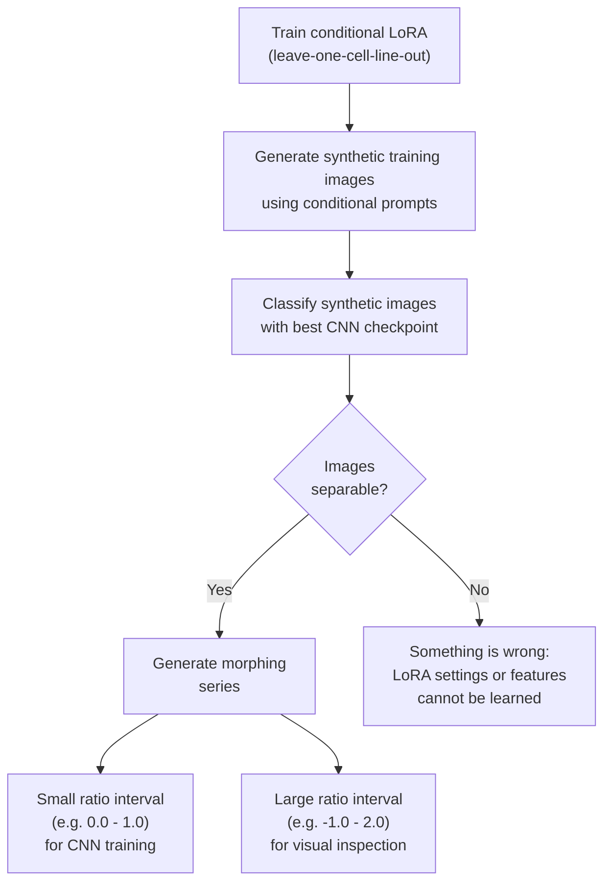
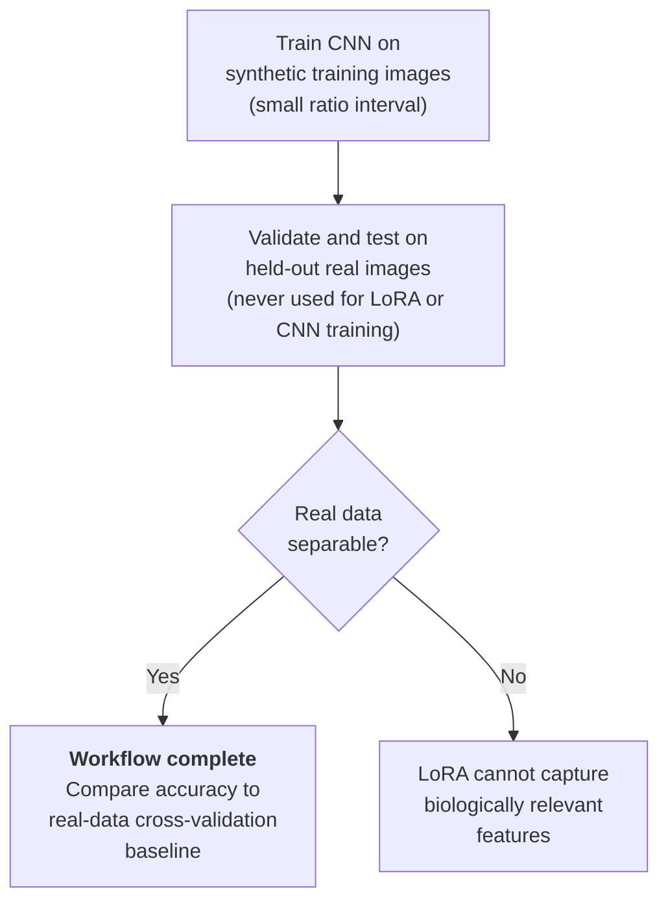

# Diffusion-Based-Phenotypic-Extrapolation

A dual-pipeline framework for label-free fibroblast classification and diffusion-based phenotypic extrapolation. The repository combines a convolutional neural network (CNN) pipeline for classification and analysis of DIC microscopy images with a generative diffusion pipeline that produces synthetic images and morphing series by interpolating between wild-type and knockout phenotypes in the latent space of a FLUX.1 model.

---

## Index

0. [Introduction](#0-introduction)
1. [Single CNN Training](#1-single-cnn-training)
   - [1.1 Create CNN Network](#11-create-cnn-network)
   - [1.2 Show Network Summary](#12-show-network-summary)
   - [1.3 Load Training Data](#13-load-training-data)
   - [1.4 Train Network](#14-train-network)
   - [1.5 Load Weights](#15-load-weights)                                                                                                                                                                                                                                
2. [Cross Validation](#2-cross-validation)
   - [2.1 Dataset Generator](#21-dataset-generator)
   - [2.2 Automatic Cross Validation](#22-automatic-cross-validation)
   - [2.3 Confidence Analyzer](#23-confidence-analyzer)
3. [Analysis](#3-analysis)
   - [3.1 Predict Class from Input Folder](#31-predict-class-from-input-folder)
   - [3.2 GradCAM Analyzer](#32-gradcam-analyzer)
   - [3.3 Class Sorter](#33-class-sorter)
   - [3.4 FID Score Calculator](#34-fid-score-calculator)
   - [3.5 Dimensionality Reduction](#35-dimensionality-reduction)
4. [Utilities](#4-utilities)
   - [4.1 Dataset Merger](#41-dataset-merger)
   - [4.2 Dataset Remover](#42-dataset-remover)
   - [4.3 Dataset Splitter](#43-dataset-splitter)
   - [4.4 Dataset Subtraction](#44-dataset-subtraction)
   - [4.5 Merge Images from Folders](#45-merge-images-from-folders)
   - [4.6 Sort Images by Frame](#46-sort-images-by-frame)
   - [4.7 Sort Images by Seed](#47-sort-images-by-seed)
5. [Preprocessing](#5-preprocessing)
   - [5.1 Export CZI Mosaic Files](#51-export-czi-mosaic-files)
   - [5.2 Generate Captions](#52-generate-captions)
6. [Export & Plotting](#6-export--plotting)
   - [6.1 Export Training Metrics to Excel](#61-export-training-metrics-to-excel)
   - [6.2 Plot UMAP / t-SNE / PaCMAP](#62-plot-umap--tsne--pacmap)
   - [6.3 Plot Confusion Matrix](#63-plot-confusion-matrix)
   - [6.4 Plot Training Curves](#64-plot-training-curves)
7. [Diffusion-Based Morphing Series Generation](#7-diffusion-based-morphing-series-generation)
   - [7.1 Prerequisites](#71-prerequisites)
   - [7.2 Workflow Selection](#72-workflow-selection)
   - [7.3 Configuration](#73-configuration)
   - [7.4 Running the Generation](#74-running-the-generation)
   - [7.5 Output Naming Convention](#75-output-naming-convention)
   - [7.6 Example Workflow](#76-example-workflow)
   - [7.7 Expected Outcome](#77-expected-outcome)
8. [Complete Workflow Through the Project](#8-complete-workflow-through-the-project)

---

## 0. Introduction

### Project Overview

This repository contains the code used to produce the results in the accompanying publication on **diffusion-based phenotypic extrapolation**. It combines two pipelines:

- A **CNN-based classification and analysis pipeline** for label-free DIC microscopy images of primary fibroblasts from patients and healthy controls
- A **diffusion-based generation pipeline** that produces synthetic images and morphing series by interpolating between wild-type and knockout phenotypes in the latent space of a FLUX.1 model adapted via LoRA

Together, these pipelines support the main scientific contributions of the paper: (1) that disease-associated morphological differences are detectable in label-free DIC images despite biological variability, and (2) that diffusion-based phenotypic extrapolation provides a tool for visualizing and quantifying these differences.

### Intended Use

This repository is a **companion to the publication**, not a general-purpose software package. It is published to:

- **Document the exact code** used to generate every figure and number in the paper
- **Enable reproduction** of the published results by reviewers and interested readers
- **Provide a starting point** for researchers who want to adapt similar methods to their own data

It is **not** intended as:

- A plug-and-play tool for arbitrary microscopy datasets
- A general-purpose image classification framework
- A production-ready software distribution

### Relationship to the Larger Workflow

This code is **one component of a broader experimental and computational workflow**. The full pipeline includes:

1. **Sample preparation** — skin biopsies, fibroblast culture, and imaging on a microscope (not part of this repository)
2. **Data generation** — DIC microscopy acquisition, CZI mosaic export (partially covered in Chapter 5)
3. **Model training** — CNN training and cross-validation (Chapters 1 and 2)
4. **Synthetic data generation** — LoRA training and diffusion-based morphing series generation (Chapter 7)
5. **Analysis and interpretation** — predictions, interpretability, dimensionality reduction, and publication figures (Chapters 3 and 6)
6. **Statistical evaluation and biological interpretation** (not part of this repository)

Chapter 8 provides a complete walkthrough that ties these steps together.

### Naming Conventions Are Critical

Throughout the pipeline, several utilities and scripts rely on **filename parsing** to link data across stages. Examples include:

- The **CZI export** (Chapter 5.1) produces files with tile and z-plane coordinates encoded in the filename
- The **Class Sorter** (Chapter 3.3) optionally appends confidence and class information to filenames, using a `_conf` separator
- The **Dataset Subtractor** (Chapter 4.4) matches files across folders by their **base identifier** (everything before the first `_conf`)
- The **Sort Images by Frame** and **Sort Images by Seed** utilities (Chapters 4.6 and 4.7) parse the ComfyUI output filenames to reconstruct series

Changing the naming convention at any stage will break downstream steps. If you adapt this code for your own data, either follow the conventions described in each chapter or update the regex patterns in the relevant utilities accordingly.

### Scope and Limitations

The scripts in this repository were developed iteratively over the course of a specific project. As the project progressed, the code became increasingly specialized — driven by the concrete requirements of the dataset, the disease model, and the imaging setup. This has consequences for reuse.

#### What works broadly

The following modules are relatively flexible and should work for other projects with minimal changes:

- **Single CNN Training** (Chapter 1) — supports many torchvision architectures, arbitrary class counts, and either grayscale or RGB input
- **Cross Validation** (Chapter 2) — generalizes to any dataset that is organized by cell line, as long as the naming conventions are followed
- **Utilities** (Chapter 4) — most utilities are generic file operations

#### What is project-specific

Several scripts were written with the specific network architecture, class structure, or data layout of this project in mind and **will not work out of the box** for other setups:

| Module | Limitation |
|--------|-----------|
| **GradCAM Analyzer** (Chapter 3.2) | Currently only works with **DenseNet-121**; other architectures will fail because the implementation accesses the `.features` attribute |
| **Dimensionality Reduction** (Chapter 3.5) | Also accesses DenseNet-specific attributes and requires a **DenseNet-121** checkpoint |
| **Class Sorter** (Chapter 3.3) | Supports arbitrary class counts, but assumes a binary WT/KO structure for the confidence analysis |
| **Confidence Analyzer** (Chapter 2.3) | Assumes **exactly two classes** (`WT` and `KO`) |
| **Export & Plotting** (Chapter 6) | Some figures (ROC, PR) are optimized for binary classification |

#### Hardcoded class names

The terms **`WT (wild-type)`** and **`KO (knockout)`** appear throughout the code — as folder names, as string constants in filtering logic, and as class labels in exported reports. Supporting an arbitrary number of classes (e.g., 3-way classification or multi-class disease subtypes) would require systematic changes across nearly every script.

#### Fixed input dimensions

The pipeline is configured for:

- **Grayscale images** (1 channel)
- **512 × 512 pixels**

Other configurations may work in some scripts but will fail in others, particularly in the diffusion-based pipeline and the Class Sorter.

#### No Defensive Error Handling

The scripts in this repository assume that the user provides correctly configured inputs and follows the documented folder structures. There is **no systematic error handling** in most cases. Common user mistakes will cause the program to crash with a Python traceback rather than printing a friendly message.

Examples of situations that will cause a crash instead of a guided error message:

- A required folder (`input/`, `data/train/`, `checkpoints/`, etc.) is missing or empty
- A checkpoint file is corrupted, truncated, or incompatible with the current model architecture
- An image has an unexpected number of channels or dimensions
- A filename does not match the expected naming convention
- A settings value is invalid (e.g., a path that does not exist, a probability outside `[0, 1]`)
- The GPU runs out of memory during training or inference
- A `.czi` file is malformed or does not match the expected mosaic structure

When the program crashes, the Python traceback usually points to the failing line and is often sufficient to diagnose the problem. However, tracing an error back to its source may require familiarity with the codebase.

**Recommendation**: Before running a module for the first time, verify that:

1. All required input folders exist and contain the expected files
2. All paths in `settings.py` point to existing locations
3. Any required checkpoints are present and loadable
4. The Python environment includes all dependencies from `requirements.txt`

If you encounter a crash, reading the traceback from the bottom up usually reveals which assumption was violated.

#### Why these limitations exist

Adapting every script to be fully general would require substantial additional development that is outside the scope of this repository. The goal here is **reproducibility of the published results**, not maximal reusability. We document the limitations so that readers can:

- Understand what will and will not work with minimal changes
- Decide whether adapting the code is feasible for their use case
- Identify the specific scripts that require modification if their setup differs

### How to Read This Document

The chapters that follow are organized by the menu structure of the main program. Each chapter includes:

- A **description** of what the module does
- **Key settings** from `settings.py` that control its behavior
- The **required folder structure** and expected **output** layout
- **Expected outcomes** with typical ranges or quantities
- A worked **example**

For a step-by-step walkthrough that shows how the pieces fit together, see Chapter 8.

---

## 1. Single CNN Training

**Description**: The Single CNN Training module provides the core workflow for building, training, and saving a CNN classifier on a single dataset (no cross-validation). It handles model creation, dataset loading with augmentations, training with learning rate scheduling and mixed precision, and checkpoint management.

The module contains five sequential actions:

| # | Action | Purpose |
|---|--------|---------|
| 1 | Create CNN Network | Instantiate the chosen architecture |
| 2 | Show Network Summary | Inspect layer shapes and parameter counts |
| 3 | Load Training Data | Load train/val images with augmentations |
| 4 | Train Network | Run the training loop and save checkpoints |
| 5 | Load Weights | Load a trained checkpoint for inference or continued training |

---

### 1.1 Create CNN Network

**Description**: Initializes a new convolutional neural network based on the architecture defined in `settings.py`. Supports a wide range of torchvision architectures as well as a fully customizable CNN.

#### Key Settings (from `settings.py`)

| Setting | Type | Description | Example Value |
|---------|------|-------------|---------------|
| `cnn_type` | str | Architecture to load (see below) | `"densenet121"` |
| `cnn_is_pretrained` | bool | Use ImageNet-pretrained weights | `True` |
| `cnn_initialization` | str | Weight init method for non-pretrained models (`"kaiming"` / `"xavier"`) | `"kaiming"` |
| `img_channels` | int | Input channels (1 = grayscale, 3 = RGB) | `1` |
| `img_width` / `img_height` | int | Input dimensions | `512` |
| `classes` | list | Class names | `["KO", "WT"]` |

#### Supported Architectures

| Family | Models |
|--------|--------|
| ResNet | `resnet18`, `resnet34`, `resnet50`, `resnet101`, `resnet152` |
| ResNeXt | `resnext101_32x8d`, `resnext101_64x4d` |
| AlexNet | `alexnet` |
| VGG | `vgg11`, `vgg13`, `vgg16`, `vgg19` (also `_bn` variants) |
| DenseNet | `densenet121`, `densenet169`, `densenet201` |
| EfficientNet | `efficientnet_b0`, `efficientnet_b3`, `efficientnet_b4`, `efficientnet_b7` |
| ConvNeXt | `convnext_tiny`, `convnext_small` |
| Custom | `custom` (see below) |

#### Using a Custom CNN Architecture

Set `cnn_type = "custom"` in `settings.py` to use your own network. The custom architecture is implemented in:

```plaintext
single_training/custom_cnn.py
```

To create your own architecture:

1. Open `single_training/custom_cnn.py`
2. Modify the `CustomCNN` class to change the layer structure
3. The class must:
   - Accept `input_channels`, `num_classes`, `batch_size`, `img_size`, and `dropout` as constructor arguments
   - Return logits of shape `(batch_size, num_classes)` from `forward()`
4. Adjust these settings in `settings.py`:

| Setting | Description |
|---------|-------------|
| `cnn_type` | Must be `"custom"` |
| `img_channels` | Number of input channels (must match first conv layer) |
| `img_width` / `img_height` | Input dimensions (must match architecture) |
| `cnn_dropout` | Dropout rate used in the custom architecture |
| `classes` | Number of output classes |

Pretrained weights are not available for `custom`, so `cnn_is_pretrained` is ignored.

#### Example Workflow

1. Configure `settings.py`:
   ```python
   cnn_type = "densenet121"
   cnn_is_pretrained = True
   classes = ["KO", "WT"]
   img_channels = 1
   ```

2. Run the program and select **1 → 1**:
   ```plaintext
   :NEW CNN NETWORK:
   Number of classes: 2
   Classes: KO, WT
   Creating new densenet121 network...
   New network was successfully created.
   Trainable parameters: 6,965,826
   ```

---

### 1.2 Show Network Summary

**Description**: Displays a detailed summary of the current model architecture, including layer output shapes, parameter counts, and trainability. Uses forward hooks to capture actual tensor shapes from a real forward pass.

#### Example Output

```plaintext
+---------------------+-------------------+------------+-----------+
| Layer (type)        | Output Shape      | Param #    | Trainable |
+---------------------+-------------------+------------+-----------+
| Conv2d              | [50, 64, 256, 256]| 640        | True      |
| BatchNorm2d         | [50, 64, 256, 256]| 128        | True      |
| ...
| Linear              | [50, 2]           | 2,050      | True      |
+---------------------+-------------------+------------+-----------+

Input: [50, 1, 512, 512] (Device: cuda:0)
Total params: 6,965,826
Trainable params: 6,965,826
Non-trainable params: 0
```

---

### 1.3 Load Training Data

**Description**: Loads training and validation images from the `data/` folders. Validation images are obtained by splitting **either** the training set **or** the test set — there is **no dedicated validation folder**. The choice is controlled by two settings in `settings.py`.

During training, only the training set is used for gradient updates, while the validation set is used to monitor performance after each epoch. Note: The single training workflow does not perform a separate test evaluation after training. To evaluate on the full test set, use the Analysis → Predict Class from Input Folder action (section 3.1) or run cross-validation (Chapter 2).

#### Key Settings (from `settings.py`)

| Setting | Type | Description | Example Value |
|---------|------|-------------|---------------|
| `ds_val_from_train_split` | float / False | Fraction of `data/train/` used for validation | `False` |
| `ds_val_from_test_split` | float / False | Fraction of `data/test/` used for validation | `1.0` |
| `ds_batch_size` | int | Batch size for training and validation | `50` |
| `ds_shuffle` | bool | Shuffle before validation split | `True` |
| `ds_shuffle_seed` | int | Random seed for reproducibility | `44` |
| `ds_num_workers` | int | Parallel data-loading subprocesses | `3` |
| `train_use_augment` | bool | Enable augmentations during training | `True` |
| `ds_save_val_images` | bool | Export validation images to a folder | `False` |

#### Validation Split Modes

Exactly one of the two split settings should be active (not `False`) at a time:

| Mode | `ds_val_from_train_split` | `ds_val_from_test_split` | Description |
|------|---------------------------|--------------------------|-------------|
| **Split from train** | `0.0 – 1.0` | `False` | Validation images are taken from `data/train/`; test set is untouched |
| **Split from test** | `False` | `0.0 – 1.0` | Training uses all of `data/train/`; validation and test images come from `data/test/` |

If both are set, the training split takes precedence and a warning is printed. If neither is set, a default of `0.1` from train is used.

#### Required Folder Structure

```plaintext
data/
├── train/               # Training images (set in `pth_train`)
│   ├── KO/              # Knockout class folder
│   └── WT/              # Wild-type class folder
└── test/                # Test images (set in `pth_test`)
    ├── KO/
    └── WT/
```

The number of classes and their folder names must match the `classes` list in `settings.py`.

#### Augmentation Pipeline (when enabled)

| Transformation | Purpose | Parameters |
|----------------|---------|------------|
| Horizontal / Vertical Flip | Simulate microscope orientation | p = 0.5 |
| 90° Rotations | All four cardinal orientations | p = 0.5 |
| Small-angle Rotation | Minor deviations | ±10°, fill = 100 |
| Color Jitter | Adjust brightness/contrast | ±20% variation |
| Gamma Correction | Simulate exposure variation | γ ∈ [0.7, 1.3] |
| Gaussian Blur | Simulate focus shifts | kernel = 5, σ ∈ [0.1, 0.5] |
| Poisson Noise | Simulate low-light noise | scaling = 0.05, strength = 0.1 |
| Normalization | Standardize pixel values | Mean = 0.5, Std = 0.5 (grayscale) |

#### Example Workflow

1. Configure `settings.py`:
   ```python
   ds_val_from_train_split = False
   ds_val_from_test_split = 1.0
   ds_batch_size = 50
   train_use_augment = True
   ```

2. Run the program and select **1 → 3**:
   ```plaintext
   :LOAD TRAINING DATA:
   Validation strategy: Using test set images for validation (100.0%)
   Training and validation datasets successfully loaded.
   Number training images/batches: 8750/175
   Number validation images/batches: 3100/62
   ```

---

### 1.4 Train Network

**Description**: Runs the training loop with the configured optimizer, learning rate scheduler, loss function, and mixed-precision acceleration. After each epoch, validation is performed and checkpoints are saved based on the selected checkpoint criterion.

#### Key Settings (from `settings.py`)

| Setting | Type | Description | Example Value |
|---------|------|-------------|---------------|
| `train_num_epochs` | int | Total training epochs | `40` |
| `train_optimizer_type` | str | Optimizer (`"SGD"`, `"ADAM"`, `"ADAMW"`) | `"ADAMW"` |
| `train_init_lr` | float | Initial learning rate | `1e-4` |
| `train_weight_decay` | float | L2 regularization strength | `1e-3` |
| `train_lr_warmup_epochs` | int | Linear warmup duration | `5` |
| `train_lr_eta_min` | float | Minimum LR for cosine annealing | `1e-5` |
| `train_use_weighted_loss` | bool | Weight loss by inverse class frequency | `True` |
| `train_label_smoothing` | float | Label smoothing factor | `0.1` |

#### Checkpoint Selection Settings

| Setting | Type | Description | Example Value |
|---------|------|-------------|---------------|
| `chckpt_save` | bool | Enable checkpoint saving | `True` |
| `chckpt_selection_method` | str | `"balanced_accuracy"`, `"composite_score"`, or `"both"` | `"balanced_accuracy"` |
| `chckpt_min_balanced_acc_threshold` | float | Minimum balanced accuracy to save | `0.65` |
| `chckpt_min_per_class_acc_balanced` | float | Minimum per-class accuracy | `0.60` |
| `chckpt_min_class_acc_threshold` | float | Minimum per-class accuracy for composite score | `0.65` |
| `chckpt_penalty_weight` | float | Penalty for class imbalance (1.0–4.0) | `2.0` |

**Checkpoint selection logic:**

- **`balanced_accuracy`** (default): Saves a checkpoint whenever balanced accuracy improves and both minimum thresholds are met. Best for most use cases.
- **`composite_score`**: Uses `overall_accuracy − penalty_weight × std(class_accuracies)`. More stringent against class imbalance.
- **`both`**: Triggers a save whenever *either* metric improves.

#### Training Pipeline

```plaintext
1. Warmup Phase (Linear LR)
   └── 5 epochs @ 1% → 100% of target LR

2. Main Training (Cosine Annealing)
   └── remaining epochs with LR decay to eta_min

3. Mixed Precision
   └── Automatic FP16/FP32 selection via GradScaler

4. Gradient Clipping
   └── max_norm = 1.0
```

#### Output

After training, results are stored under:

```plaintext
output/train/[timestamp]/
├── checkpoints/             # Saved .pt files
├── plots/                   # Metrics, confusion matrices, ROC/PR data
├── logs/                    # TensorBoard event files
│   └── probabilities/       # Per-epoch probabilities (.npz + .json)
├── settings_copy.py         # Snapshot of settings.py
└── training_examples.png    # Image grid from the training set
```

#### TensorBoard

To visualize training progress, launch TensorBoard from the project root:

```bash
python -m tensorboard.main --logdir "output/train/[timestamp]/logs"
```

Then open the printed URL in your browser (usually `http://localhost:6006`). TensorBoard displays loss curves, accuracy, per-class metrics, ROC curves, and confusion matrices.

#### Checkpoint Naming Convention

```plaintext
ckpt_{pretrained}_{arch}_e{epoch}_bal{balanced_acc}_comp{composite_score}{dataset_suffix}.pt
```

| Part | Meaning | Example |
|------|---------|---------|
| `pretr` / `scratch` | Pretrained or from-scratch weights | `pretr` |
| `{arch}` | Architecture name | `densenet121` |
| `e{epoch}` | Epoch (zero-padded) | `e23` |
| `bal{acc}` | Balanced accuracy | `bal0.860` |
| `comp{score}` | Composite score | `comp0.812` |
| `{dataset_suffix}` | Cross-validation suffix (`_dsXX`), omitted for single training | *(empty)* |

**Example:** `ckpt_pretr_densenet121_e23_bal0.860_comp0.812.pt`

#### Example Workflow

1. Configure `settings.py`:
   ```python
   train_num_epochs = 40
   chckpt_selection_method = "balanced_accuracy"
   chckpt_min_balanced_acc_threshold = 0.65
   chckpt_min_per_class_acc_balanced = 0.60
   ```

2. Run the program and select **1 → 4**:
   ```plaintext
   :TRAIN NETWORK:
     Results will be saved to output/train/[timestamp]/
   Start training...

   >> Epoch [1/40]:
   Train: 100%|████████| 175/175 [02:15<00:00]
   > Train Loss: 0.583 | Weighted Train Acc: 0.712 | Learning Rate: 0.000020
   Valid: 100%|████████| 62/62 [00:23<00:00]
   > Val Loss: 0.412 | Weighted Val Acc: 0.781 | Per-class: (0.79 KO | 0.77 WT)
   > Balanced Accuracy: 0.781 | Composite Score: 0.764
   > Class STD: 0.008 | Min Class Acc: 77.3%
   ✓ Model saved! Epoch 1
   ```

---

### 1.5 Load Weights

**Description**: Loads a previously saved checkpoint for inference or continued training. If the `checkpoints/` folder contains a single file, it is loaded automatically; otherwise, an interactive table allows selection.

#### Key Settings (from `settings.py`)

| Setting | Type | Description | Example Value |
|---------|------|-------------|---------------|
| `pth_checkpoint` | Path | Directory containing saved checkpoints | `BASE_DIR / "checkpoints/"` |

#### Required Folder Structure

```plaintext
checkpoints/
├── ckpt_pretr_densenet121_e23_bal0.860_comp0.812.pt
├── ckpt_pretr_densenet121_e18_bal0.842_comp0.798.pt
└── ckpt_scratch_resnet50_e11_bal0.771_comp0.743.pt
```

#### Example Workflow

1. Place one or more `.pt` files in `checkpoints/`
2. Run the program and select **1 → 5**:
   ```plaintext
   :LOAD WEIGHTS:
   Found single checkpoint: ckpt_pretr_densenet121_e23_bal0.860_comp0.812.pt
   Loading automatically...
   Weights from checkpoint ckpt_pretr_densenet121_e23_bal0.860_comp0.812.pt successfully loaded.
   ```

   With multiple checkpoints:
   ```plaintext
   +----+---------------------------------------------------------------+
   | ID | Checkpoint                                                    |
   +----+---------------------------------------------------------------+
   | 1  | ckpt_pretr_densenet121_e23_bal0.860_comp0.812.pt              |
   | 2  | ckpt_pretr_densenet121_e18_bal0.842_comp0.798.pt              |
   | 3  | ckpt_scratch_resnet50_e11_bal0.771_comp0.743.pt               |
   +----+---------------------------------------------------------------+
   Select a checkpoint: 1
   Weights from checkpoint ckpt_pretr_densenet121_e23_bal0.860_comp0.812.pt successfully loaded.
   ```

---

## 2. Cross Validation

**Description**: The Cross Validation module automates leave-one-cell-line-out validation, ensuring that the CNN learns disease-associated morphological features rather than cell-line-specific artifacts. It handles dataset generation, iterative training across all WT/KO cell-line combinations, automatic test evaluation on held-out cell lines, and identification of consistently reliable images across all folds.

#### Real vs. Synthetic Images

This module distinguishes between two types of images:

| Type | Source | Purpose |
|------|--------|---------|
| **Real images** | Primary fibroblasts acquired via DIC microscopy | Ground truth for evaluation; used for both training and validation/testing |
| **Synthetic images** | Generated by a FLUX.1 diffusion model fine-tuned with LoRA on real images | Training data only; never used for validation or testing |

Synthetic images are a **data augmentation strategy for training only**. Validation and test sets must consist exclusively of real images, because the goal is to measure how well the model generalizes to real cells — the actual target of classification. For this reason, the Confidence Analyzer explicitly filters synthetic images out of all downstream analyses.

The recommended configurations are therefore:

- **`real_only`**: Train, validate, and test all on real images (baseline, always valid)
- **`synthetic_only`**: Train on synthetic images, validate and test on real images (recommended when synthetic data is available)

The `mixed` option allows training on both real and synthetic images in a single pool. When this mode is used, the script automatically excludes synthetic images from validation and test splits — only real images are recorded in `split_info.json` (see section 2.2) and used for evaluation. This ensures that performance is always measured on real cells, regardless of which training mode was chosen. The user should still be aware that this filtering happens silently, and that the effective real-image pool for validation and testing is smaller than the raw contents of the test folder.

The module contains three sequential actions:

| # | Action | Purpose |
|---|--------|---------|
| 1 | Dataset Generator | Prepare all train/test dataset combinations |
| 2 | Automatic Cross Validation | Train and test on every WT/KO combination |
| 3 | Confidence Analyzer | Identify reliably classified images across all folds |

---

### 2.1 Dataset Generator

**Description**: Creates all possible leave-one-cell-line-out dataset combinations. For each combination, one WT and one KO cell line are held out for testing while the remaining cell lines are used for training. This generates `N_WT × N_KO` independent datasets (e.g., 5 WT × 4 KO = 20 datasets). Each dataset contains a `train/` and `test/` folder with the WT/KO class subdirectories.

**Note on workflow**: The Dataset Generator is **not required** for running cross-validation. When you start Automatic Cross Validation (section 2.2), datasets are generated on the fly for each fold. In this `acv` mode, the training and test images are copied into `data/train/` and `data/test/`, trained on, and then cleaned up before the next fold begins. This standalone generator (in `gen` mode) is meant for cases where you want to **inspect, modify, or reuse a specific dataset combination** — for example, to experiment on a particular WT/KO pair, to compare against a different model, or to reproduce a previous result. It writes the datasets to `dataset_gen/output/dataset_XX/train/` and `dataset_gen/output/dataset_XX/test/` so they persist across sessions.

The dataset generator supports three training data source modes, controlled by `train_data_source`. In all modes, validation and test images are drawn from **real images only** — synthetic images are used exclusively for training.

| Mode | Training data | Validation / test data | Recommended |
|------|--------------|------------------------|-------------|
| `real_only` | Real images | Real images | ✅ Baseline |
| `synthetic_only` | Synthetic images | Real images | ✅ For synthetic-augmented training |
| `mixed` | Real + synthetic images (pooled) | Real images | ⚠️ Synthetic images are filtered from val/test |

#### Key Settings (from `settings.py`)

| Setting | Type | Description | Example Value |
|---------|------|-------------|---------------|
| `cv_train_data_source` | str | `"mixed"`, `"synthetic_only"`, or `"real_only"` | `"real_only"` |
| `wt_lines` | list | Wild-type cell line folder names | `["line_1", "line_2", "line_3", "line_4", "line_5"]` |
| `ko_lines` | list | Knockout cell line folder names | `["line_6", "line_7", "line_8", "line_9"]` |
| `classes` | list | Class names matching folder structure | `["KO", "WT"]` |

#### Required Folder Structure (Input)

```plaintext
dataset_gen/
├── input_synthetic/           # Synthetic images (for synthetic_only mode)
│   ├── line_1/
│   ├── line_2/
│   ├── ...
│   ├── line_6/
│   └── ...
├── input_real/                # Real images (for synthetic_only and real_only modes)
│   ├── line_1/
│   ├── line_2/
│   ├── ...
│   ├── line_6/
│   └── ...
└── input_mixed/               # Mixed source (for mixed mode)
    ├── line_1/
    └── ...
```

Each cell-line folder contains images of that specific cell line. Images are split by cell line, not by image — this is the key to the leave-one-cell-line-out design.

#### Output Structure (Generated Datasets)

For `N_WT = 5` and `N_KO = 4`, 20 datasets are generated under `dataset_gen/output/`:

```plaintext
dataset_gen/output/
├── dataset_1/
│   ├── train/
│   │   ├── WT/                 # All WT lines except the held-out one
│   │   └── KO/                 # All KO lines except the held-out one
│   ├── test/
│   │   ├── WT/                 # Only the held-out WT line
│   │   └── KO/                 # Only the held-out KO line
│   └── dataset_1_info.txt      # Metadata (cell lines, image counts)
├── dataset_2/
...
└── dataset_20/
```

#### Example Workflow

1. Place cell-line folders with images in `dataset_gen/input_real/`
2. Configure `settings.py`:
   ```python
   train_data_source = "real_only"
   wt_lines = ["line_1", "line_2", "line_3", "line_4", "line_5"]
   ko_lines = ["line_6", "line_7", "line_8", "line_9"]
   ```

3. Run the program and select **2 → 1**:
   ```plaintext
   :DATASET GENERATOR FOR CROSS VALIDATION:
   Training data source: real_only
   Synthetic folder: .../dataset_gen/input_synthetic
   Real folder: .../dataset_gen/input_real

   Generation of datasets is starting...
   Mode: real_only
   Dataset 1: real_only mode
     Training images: WT=1250, KO=980
     Test images: WT=280, KO=210
   ...
   Datasets successfully created and saved to .../dataset_gen/output!
   ```

---

### 2.2 Automatic Cross Validation

**Description**: This action generates datasets internally and does not require the standalone Dataset Generator to have been run first. Training and test images for each fold are placed temporarily in `data/train/` and `data/test/`, then removed before the next fold begins. Runs the complete cross-validation loop over all generated datasets. For each fold, it creates the dataset, trains a model on the training cell lines, evaluates all saved checkpoints on the held-out test cell lines, and saves confusion matrices and per-checkpoint test metrics.

Since validation images are drawn from the test set (`ds_val_from_test_split`), test evaluation uses the **remaining** images in the test set that were not consumed by validation. If `ds_val_from_test_split` is `1.0`, all test images are used for validation and no test evaluation takes place.

#### Key Settings (from `settings.py`)

All training settings from Single Training apply. The following are the cross-validation-specific settings:

| Setting | Type | Description | Example Value |
|---------|------|-------------|---------------|
| `ds_val_from_test_split` | float / False | Fraction of test set used for validation | `0.3` |
| `ds_val_from_train_split` | float / False | Fraction of train set used for validation | `False` |
| `chckpt_selection_method` | str | `"balanced_accuracy"`, `"composite_score"`, or `"both"` | `"balanced_accuracy"` |
| `chckpt_min_balanced_acc_threshold` | float | Minimum balanced accuracy to save | `0.65` |
| `chckpt_min_per_class_acc_balanced` | float | Minimum per-class accuracy | `0.60` |
| `cv_folds_to_train` | list / None | Which folds to train (1-based). `None` or `[]` means all folds. | `None` |
| `cv_skip_existing_folds` | bool | Skip folds that already have checkpoints | `True` |

#### Fold Selection (`cv_folds_to_train`)

By default, all `N_WT × N_KO` folds are trained in a single run. The `cv_folds_to_train` setting allows restricting the run to a subset of folds.

| Value | Behavior |
|-------|----------|
| `None` | Train all folds (default) |
| `[]` (empty list) | Same as `None` — train all folds |
| `[1, 4, 10]` | Train only folds 1, 4, and 10 |
| `[13, 14, 15, 16, 17, 18, 19, 20]` | Train only the last eight folds (useful for resuming a partial run) |

The fold indices are **1-based** and correspond to the order of `wt_lines × ko_lines`. For example, with 5 WT lines and 4 KO lines, folds 1–20 exist.

Example console output with `cv_folds_to_train = [13, 14, 15]`:

```plaintext
Fold filtering enabled
  Requested folds: [13, 14, 15]
  Available folds: 1–20
  Matched folds:   [13, 14, 15]

>> PROCESSING DATASET 13 OF 3:
...
```

If a requested fold does not exist (e.g., `21` in a 20-fold setup), a warning is printed and the run continues with the folds that do exist:

```plaintext
  WARNING: The following requested folds do not exist: [21]
```

#### Skipping Existing Folds (`cv_skip_existing_folds`)

When enabled (`True`, the default), the cross-validation script automatically skips folds that already have a completed checkpoint folder. A fold is considered "already done" if:

1. `output/cross_validation/dataset_X/` exists
2. It contains a `checkpoints/` subfolder
3. That subfolder contains at least one `.pt` file

This makes resuming a partial run safe: previously completed folds are preserved, and only missing folds are trained.

Example console output on a resume:

```plaintext
Skipping folds that already have checkpoints: [1, 2, 3, 4, 5, 6, 7, 8, 9, 10, 11, 12]

>> PROCESSING DATASET 13 OF 8:
...
```

**To force a full re-run**, set `cv_skip_existing_folds = False`. This causes all requested folds to be processed, overwriting any existing results.

**Edge cases:**

| Scenario | Behavior |
|----------|----------|
| Requested fold does not exist | Warning printed, fold is ignored |
| All requested folds already exist | "No folds to process. Exiting." and the script returns cleanly |
| Fold folder exists but has no checkpoints | Fold is processed (treated as incomplete) |
| Both a nonexistent fold and an existing fold are requested | Both messages printed; run continues with the remaining folds |

#### Test Set Split Behavior

For test evaluation to run, `ds_val_from_test_split` must be between `0.0` and `1.0`:

| `ds_val_from_test_split` | Behavior |
|--------------------------|----------|
| `False` | Test set untouched during validation; but test evaluation is still skipped (only triggers when split is active) |
| `0.3` | 30% of test set used for validation, 70% used for final test evaluation |
| `1.0` | All test images used for validation; **no test evaluation** |

To evaluate on the full test set, use the **training split for validation** instead (`ds_val_from_train_split = 0.1`, `ds_val_from_test_split = False`).

#### Output Structure

Each fold produces its own result folder:

```plaintext
output/cross_validation/
├── dataset_1/
│   ├── checkpoints/            # Saved .pt files for this fold
│   │   ├── ckpt_pretr_densenet121_e23_bal0.860_comp0.812_ds1.pt
│   │   └── ...
│   ├── plots/                  # Validation AND test confusion matrices + ROC/PR data
│   │   ├── ckpt_..._val_cm.png
│   │   ├── ckpt_..._val_cm.json
│   │   ├── ckpt_..._test_cm.png
│   │   ├── ckpt_..._test_cm.json
│   │   └── ...
│   ├── logs/                   # TensorBoard event files
│   │   └── probabilities/      # Per-epoch probability data
│   └── split_info.json         # Records which real images were in validation vs test
├── dataset_2/
...
└── dataset_20/
```

The `split_info.json` records **only real images** used for validation and testing, filtered from any synthetic images. It is used downstream by the Confidence Analyzer.

#### Split Tracking with `split_info.json`

After each fold is created, the cross-validation script writes a `split_info.json` file into the fold's result folder (`output/cross_validation/dataset_XX/split_info.json`). This file records exactly which images were assigned to validation and which to testing.

Its purpose is to prevent **validation leakage** — the situation where an image used for monitoring during training is later reused for the final test evaluation, which would artificially inflate the test accuracy.

Key properties of `split_info.json`:

- **Real images only**: Synthetic images are filtered out before recording. This is enforced by the `is_synthetic_image()` check, which detects synthetic filenames by their `s<digit>...` pattern.
- **Disjoint splits**: The validation and test sets are guaranteed to be non-overlapping. If any image appears in both, the script corrects the overlap before writing the file.
- **Consumed by downstream steps**: Both the test evaluation in this module (2.2) and the Confidence Analyzer (2.3) read `split_info.json` to determine which images belong to which split.

Example structure of the file:

```json
{
  "validation": {
    "WT": ["img_0001.png", "img_0002.png", ...],
    "KO": ["img_0100.png", "img_0101.png", ...]
  },
  "test": {
    "WT": ["img_0050.png", "img_0051.png", ...],
    "KO": ["img_0150.png", "img_0151.png", ...]
  },
  "metadata": {
    "total_images_found": 620,
    "real_images_used": 520,
    "synthetic_filtered": 100,
    "note": "Only real images are recorded for validation/testing"
  }
}
```

The `metadata` block makes the filtering transparent: the user can see how many synthetic images were removed and how many real images remained for evaluation.

#### Example Workflow

1. Configure `settings.py`:
   ```python
   ds_val_from_train_split = False
   ds_val_from_test_split = 0.3
   chckpt_selection_method = "balanced_accuracy"
   ```

2. Run the program and select **2 → 2**:
   ```plaintext
   :AUTOMATIC CROSS VALIDATION:
     Results will be saved to output/cross_validation/

   Cleaning up old train and test data...
   Cleanup finished.

   >> PROCESSING DATASET 1 OF 20:
   Cell line for testing WT group: line_1
   Cell line for testing KO group: line_6

   > Create dataset 1...
   Dataset 1 successfully created.

   > Load dataset 1 for training...
   Number training images/batches: 4280/86
   Number validation images/batches: 147/3

   > Start training on dataset 1...
   >> Epoch [1/40]: ...
   ...
   Training on dataset 1 successfully finished.

   >>> Evaluating ALL checkpoints on TEST set (343 images)...
   Found 3 checkpoints to evaluate on test set
     > Testing checkpoint epoch 23 (val_acc=86%)...
       Test accuracy: 84.55%
       Test WT: 85.12%
       Test KO: 83.98%
   ✅ Finished testing all checkpoints for dataset 1
   ...
   Cross-validation complete.
   ```

---

### 2.3 Confidence Analyzer

**Description**: Analyzes predictions across all cross-validation folds to identify images that are consistently and reliably classified by multiple independently trained models. This is used to build a **high-confidence dataset** for downstream applications such as LoRA training on diffusion models or further analysis.

The analyzer loads the top checkpoints from each fold (selected by a configurable metric), runs predictions on the corresponding held-out test images, aggregates the results per image, and copies images that meet the configured filter criteria into a categorized output folder.

**Note on missing checkpoints**: If a fold does not produce a usable checkpoint (or its confusion matrix JSON is missing), the images from that fold are simply not evaluated and are excluded from the analysis. Images are only required to be **unanimously correct (or incorrect) across the folds that actually evaluated them**. An image seen by only 2 of 20 folds can still qualify if both predictions agree and meet the confidence threshold.

Because synthetic images are used only for training, they are explicitly excluded from all confidence analysis. The analyzer filters them out using the `split_info.json` file generated during cross-validation, which records only real images for validation and test splits. This ensures that the high-confidence dataset used for downstream applications (e.g., LoRA training) consists exclusively of real cells.

#### Prerequisites

For the Confidence Analyzer to run successfully, the following files must exist for each cross-validation fold. They are produced automatically by section 2.2 (Automatic Cross Validation):

| Prerequisite | Location | Purpose |
|--------------|----------|---------|
| Saved checkpoints | `output/cross_validation/dataset_XX/checkpoints/*.pt` | Models to be evaluated |
| Confusion matrix JSON | `output/cross_validation/dataset_XX/plots/*_val_cm.json` (or `*_test_cm.json`) | Checkpoint selection metrics |
| Split info | `output/cross_validation/dataset_XX/split_info.json` | Which images were validation vs. test |
| Source images | `dataset_gen/input_real/line_X/` (or per `train_data_source`) | Original images to copy from |

If any of these are missing for a fold, that fold will be skipped and a warning will be printed. Folds are not re-generated by the analyzer — they must already exist.

#### Key Settings (from `settings.py`)

| Setting | Type | Description | Example Value |
|---------|------|-------------|---------------|
| `ca_min_conf` | float | Minimum confidence threshold | `0.8` |
| `ca_max_conf` | float | Maximum confidence threshold | `1.0` |
| `ca_filter_type` | str | Filter mode: `"correct"`, `"incorrect"`, `"low_confidence"`, `"unsure"` | `"correct"` |
| `ca_max_ckpts` | int | Maximum checkpoints analyzed per fold | `1` |
| `ca_ckpt_select_method` | str | Checkpoint selection metric | `"balanced_accuracy"` |
| `ca_use_test_cm` | str | Which confusion matrix to use for checkpoint selection: `"validation"` or `"test"` | `"validation"` |
| `ca_split_to_use` | str | Which split to analyze: `"validation"`, `"test"`, or `"all"` | `"validation"` |
| `ca_rename_with_confidence` | bool | Rename filtered images with confidence in the filename | `True` |

#### Filter Types

| Type | Confidence Range | Correctness Requirement | Output Folder | Use Case |
|------|------------------|-------------------------|---------------|----------|
| `correct` | `[min, max]` | Must be correct in all folds | `high_confidence_correct` | Reliable predictions |
| `incorrect` | `[min, max]` | Must be wrong in all folds | `high_confidence_incorrect` | Systematic errors |
| `low_confidence` | `< min` | Ignored | `low_confidence` | Ambiguous cases |
| `unsure` | `[min, max]` | Ignored | `medium_confidence_unsure` | Borderline predictions |

#### Checkpoint Selection Metrics

| Metric | Description |
|--------|-------------|
| `balanced_accuracy` | Average of WT and KO accuracy (recommended) |
| `balanced_sum` | `(WT + KO) − abs(WT − KO)` (favors balanced performance) |
| `f1_score` | Harmonic mean of WT and KO accuracy |
| `min_difference` | Minimum of WT and KO accuracy |
| `composite_score` | `overall_accuracy − penalty_weight × std(class_accuracies)` |

#### Output Structure

```plaintext
output/conf_analyzer/
├── high_confidence_correct/
│   ├── WT/
│   │   ├── img1_conf98.png
│   │   └── img2_conf95.png
│   └── KO/
│       └── img3_conf92.png
├── confidence_analysis.csv      # Per-fold, per-class prediction statistics
├── used_checkpoints.csv         # Which checkpoints were analyzed per fold
└── README.txt                   # Description of the filter applied
```

When `ca_rename_with_confidence = True` (default), filtered images are renamed with the average softmax confidence in the filename (e.g., `img1_conf98.png`). When `False`, original filenames are preserved. The correctness rate is used internally for filtering but is not included in the filename.

#### Expected Outcome

The retention rate depends on the filter type and the total number of folds. For `ca_filter_type = "correct"`, the analyzer typically retains **20–35%** of real images — the ones consistently recognized by all independently trained models. This subset is enriched for unambiguous, high-confidence examples of each phenotype and is well-suited for downstream tasks such as LoRA training on diffusion models.

| Filter | Typical Yield | Interpretation |
|--------|---------------|----------------|
| `correct` | 20–35% | Images consistently recognized by all folds |
| `incorrect` | 1–5% | Images systematically misclassified (potential label issues or biologically ambiguous) |
| `low_confidence` | 5–15% | Images with high biological variability |
| `unsure` | 10–20% | Borderline cases near the decision boundary |

Exact retention rates vary with the number of folds, the choice of cell lines, and the confidence thresholds.

#### Filename Convention

The naming of filtered images is controlled by `ca_rename_with_confidence`:

| Setting | Filename format | Example |
|---------|----------------|---------|
| `True` (default) | `<original_stem>_conf<XX>.<ext>` | `img_0001_conf95.png` |
| `False` | `<original_filename>` | `img_0001.png` |

When renaming is enabled, `XX` is the **average softmax confidence** across all folds that evaluated the image, rounded to the nearest integer percent. The correctness rate is used internally to select images but is not included in the filename, to keep the filenames concise.

#### Example Workflow

1. Ensure cross-validation has been run (section 2.2), so that `output/cross_validation/dataset_XX/` folders exist
2. Configure `settings.py`:
   ```python
   ca_min_conf = 0.8
   ca_max_conf = 1.0
   ca_filter_type = "correct"
   ca_max_ckpts = 1
   ca_ckpt_select_method = "balanced_accuracy"
   ca_use_test_cm = "validation"
   ca_split_to_use = "validation"
   ```
3. Run the program and select **2 → 3**:
   ```plaintext
   :CONFIDENCE ANALYZER:
     Input: output/cross_validation/
     Output: output/conf_analyzer/

   Starting confidence analysis...
   Found 20 datasets to analyze
   Training data source: real_only
   Using VALIDATION confusion matrices for checkpoint selection
   Using 'VALIDATION' split for analysis
   Checkpoint selection method: balanced_accuracy
   Results will be saved to: .../output/conf_analyzer/confidence_analysis.csv
   ```
4. **Checkpoint selection (automatic)**: For each fold, the analyzer identifies all checkpoints, reads their corresponding confusion matrix JSON files, and ranks them by the metric defined in `ca_ckpt_select_method`. The top `ca_max_ckpts` per fold are selected for evaluation. Example console output during this step:
   ```plaintext
   Processing datasets:  10%|█         | 2/20 [00:15<02:15]
   Selected top 1 checkpoints by 'balanced_accuracy':
     1. ckpt_pretr_densenet121_e23_bal0.860_comp0.812_ds01.pt:
        score=0.8600 (WT=86.2%, KO=85.8%, overall=86.0%)
   ```
5. After all folds are processed, the analyzer aggregates predictions per image across the selected checkpoints and applies the filter defined in `ca_filter_type`:
   ```plaintext
   Found 3421 images matching criteria. Organizing...
   Filtered images saved to: .../output/conf_analyzer/high_confidence_correct
   ```
6. The results are written to `output/conf_analyzer/`:
   - `high_confidence_correct/` (or the folder matching your filter type) — the selected images, organized by class
   - `confidence_analysis.csv` — per-fold, per-class statistics
   - `used_checkpoints.csv` — which checkpoints were used per fold
   - `README.txt` — description of the filter applied

   ```plaintext
   Analysis complete!
   ```

---

## 3. Analysis

**Description**: The Analysis module provides tools for evaluating trained models and inspecting their behavior. It covers single-image prediction, gradient-based visualization for model interpretability, high-confidence image selection for downstream applications, FID-based image quality assessment, and dimensionality reduction for embedding visualization.

The module contains five actions:

| # | Action | Purpose |
|---|--------|---------|
| 1 | Predict Class from Input Folder | Classify images in `input/` using a trained checkpoint |
| 2 | GradCAM Analyzer | Visualize which regions drive the model's decision |
| 3 | Class Sorter | Select high-confidence images for downstream training |
| 4 | FID Score Calculator | Measure distribution distance between image folders |
| 5 | Dimensionality Reduction | Project CNN embeddings into 2D for visualization |

All actions in this module read from `input/` and write to `output/` (or a subfolder thereof). Place the relevant images or folders in `input/` before starting an action.

---

### 3.1 Predict Class from Input Folder

**Description**: Runs a trained CNN on all images in `input/` (including subfolders) and produces a per-folder classification report. Each folder in `input/` is treated as a group, and the model predicts the class for every image within it. Outputs include class distribution, average confidence, logit statistics, and optionally renamed filenames encoding the prediction.

This is the primary way to evaluate a single checkpoint on new images outside of cross-validation — for example, to run a trained model on a held-out test set or on a new batch of samples.

#### Key Settings (from `settings.py`)

| Setting | Type | Description | Example Value |
|---------|------|-------------|---------------|
| `classes` | list | Class names matching the model's output | `["KO", "WT"]` |
| `img_channels` | int | Input channels (1 = grayscale, 3 = RGB) | `1` |
| `analyze_rename_with_confidence` | bool | Rename images with confidence in the filename | `False` |
| `analyze_include_logits_in_rename` | bool | Also include max logit in the filename | `False` |

#### Required Folder Structure

```plaintext
input/
├── group_1/                 # Any folder name
│   ├── img_0001.png
│   └── img_0002.png
├── group_2/
│   └── img_0003.png
└── ...
```

Each subfolder is treated as a group and processed independently. Images placed directly in `input/` are not processed — they must be inside subfolders.

#### Output

```plaintext
output/
├── results_[checkpoint].csv           # One row per input folder
└── logit_statistics_[checkpoint].json # Detailed per-folder logit statistics
```

The CSV contains, for each folder: total images, per-class counts and percentages, most likely class, average confidence, max logit statistics (mean, std, min, max), and a logit health score (0–100).

#### Expected Outcome

| Metric | Range | Interpretation |
|--------|-------|----------------|
| Average confidence | 0.5–1.0 | >0.9 strong, 0.75–0.9 moderate, 0.5–0.75 weak |
| Max logit (mean) | −5 to +15 | >5 confident, 0–5 positive, <0 uncertain |
| Logit health score | 0–100 | >75 excellent, 50–75 acceptable, <50 concerning |
| Uncertain images | 0–50% | Percentage with max logit < 0 |

#### Example Workflow

1. Place folders of images to classify in `input/`
2. Configure `settings.py`:
   ```python
   classes = ["KO", "WT"]
   analyze_rename_with_confidence = False
   ```
3. Ensure a checkpoint is present in `checkpoints/`
4. Run the program and select **3 → 1**:
   ```plaintext
   :PREDICT CLASS FROM INPUT FOLDER:
     Place images to classify in the input/ folder
     Results will be saved to output/

   Creating new densenet121 network...
   New network was successfully created.
   Successfully loaded weights from ckpt_pretr_densenet121_e23_bal0.860_comp0.812.pt

   Analyzing 4 folders...
   ============================================================
   > Processing folder: group_1
   ============================================================
   Predicting group_1: 100%|████████| 240/240 [00:18<00:00]

   RESULTS for group_1:
     Total images: 240
     Most likely class: WT
     Avg confidence: 0.892
     Logit statistics:
       • Avg max logit: 4.21
       • Logit range: 6.83
       • Uncertain images: 12 (5.0%)
       • Logit health score: 82.4/100

   Saved results to: output/results_ckpt_pretr_densenet121_e23_bal0.860_comp0.812.csv
   Analysis complete - Summary
   Total folders analyzed: 4
   Total images analyzed: 960
   ```

---

### 3.2 GradCAM Analyzer

**Description**: Applies Gradient-weighted Class Activation Mapping (Grad-CAM) to visualize which regions of each input image contributed most strongly to the model's prediction. Heatmaps are overlaid on the original DIC images using a jet colormap, revealing the morphological features the CNN relies on.

A second-iteration mode blurs the most salient regions, then re-runs Grad-CAM to reveal secondary or compensatory features. This is useful for understanding whether the model's decision is driven by a single dominant feature or a distributed set of cues.

**Important**: This implementation is **only compatible with DenseNet-121**. The Grad-CAM computation accesses the `.features` attribute that only exists on DenseNet models. Using any other architecture will fail. A trained checkpoint must be present in `checkpoints/` — the analyzer will prompt for selection if multiple files are found.

#### Key Settings (from `settings.py`)

| Setting | Type | Description | Example Value |
|---------|------|-------------|---------------|
| `classes` | list | Class names matching the model | `["KO", "WT"]` |
| `gradcam_second_iteration` | bool | Enable the blur-and-rerun diagnostic mode | `False` |
| `gradcam_threshold_percent` | float | Fraction of most salient pixels to blur | `0.40` |
| `gradcam_blurr_sigma` | float | Gaussian blur strength for the second pass | `15` |
| `gradcam_export_only_overlay` | bool | Export only the overlay image | `True` |
| `captum_alpha_overlay` | float | Heatmap transparency (0–1) | `0.4` |

#### Required Folder Structure

```plaintext
input/
├── group_1/                 # Any folder name
│   ├── img_0001.png
│   └── img_0002.png
└── ...
```

#### Output

```plaintext
output/
└── group_1_gradcam_[class]/
    ├── img_0001_gradcam-[class].png
    └── ...
```

When `gradcam_export_only_overlay = True`, each output is a 512×512 image with the Grad-CAM heatmap overlaid on the original. Otherwise, a three-panel figure (original / heatmap / overlay) is produced.

#### Expected Outcome

| Heatmap Color | Meaning |
|---------------|---------|
| Red / warm | Strong positive evidence for the predicted class |
| Yellow / green | Secondary supporting evidence |
| Blue / cold | Regions that did not contribute to the prediction |

If the model relies on meaningful morphology, heatmaps should concentrate on relevant cellular structures (cytoskeleton, protrusions, cell body) rather than on background or debris.

#### Example Workflow

1. Place images to analyze in a subfolder of `input/`
2. Configure `settings.py`:
   ```python
   gradcam_second_iteration = False
   gradcam_threshold_percent = 0.40
   gradcam_export_only_overlay = True
   ```

3. Ensure a trained DenseNet-121 checkpoint is present in `checkpoints/`

4. Run the program and select **3 → 2**:
   ```plaintext
   :GradCAM ANALYZER:
     Input: input/ (place images to analyze)
     Output: output/gradcam/

   Found single checkpoint: ckpt_pretr_densenet121_e23_bal0.860_comp0.812.pt
   Select class for GradCAM analysis (1-2): 1
   ✓ Selected class: KO

   Applying GradCAM for class: KO
   Processing images...
   Grad-CAM Analysis: 100%|████████| 120/120 [00:47<00:00]
   Saved visualizations to: output/group_1_gradcam_KO/
   ```

---

### 3.3 Class Sorter

**Description**: Runs a trained CNN on all images in `input/` (any folder structure) and selects images based on configurable confidence and logit criteria. The selected images are copied into an output folder organized by predicted class.

Although the tool is often used to curate **high-confidence examples** for downstream training (e.g., LoRA fine-tuning of diffusion models), it is more general: it can select images across the full confidence spectrum, including **low-confidence outliers**, **borderline cases within a specific confidence interval**, or **systematically misclassified images** depending on the chosen filter. This makes it useful for both data curation and diagnostic analysis of model behavior.

The Class Sorter supports three selection modes and three filter modes:

**Selection modes**:
- `top_n`: Select the N highest-scoring images per class
- `threshold`: Select all images above a threshold
- `interval`: Select all images whose score falls within a range

**Filter modes**:
- `confidence_only`: Use softmax confidence only
- `logits_only`: Use the raw max logit only (filters uncertain predictions)
- `combined`: Require both criteria to pass

The tool is flexible about input folder structure. If images are in folders named after the configured classes, ground-truth is used to require correctness. Otherwise, all predictions are accepted.

**Note**: A trained checkpoint must be present in `checkpoints/`. The sorter will select one automatically if only one exists, or prompt for selection otherwise.

#### Key Settings (from `settings.py`)

| Setting | Type | Description | Example Value |
|---------|------|-------------|---------------|
| `sort_selection_mode` | str | `"top_n"`, `"threshold"`, or `"interval"` | `"interval"` |
| `sort_selection_value` | varies | N (int), threshold (float), or [min, max] | `[0.5, 1.0]` |
| `sort_filter_mode` | str | `"confidence_only"`, `"logits_only"`, or `"combined"` | `"confidence_only"` |
| `sort_logit_threshold` | float | Minimum max logit to keep (for logit-based modes) | `0.0` |
| `sort_rename_images` | bool | Rename images with confidence/logit in filename | `True` |
| `sort_pred_batch_size` | int | Batch size for prediction | `50` |
| `sort_conf_intervals` | list | Confidence intervals for the statistics report | `[10, 20, ..., 90]` |
| `sort_logit_intervals` | list | Logit intervals for the statistics report | `[-10, -5, -2, 0, 2, 5, 10]` |

#### Required Folder Structure

The sorter accepts any folder structure:

**Option A — Flat or arbitrary folders** (all predictions accepted):
```plaintext
input/
├── anything/
│   ├── img_0001.png
│   └── img_0002.png
└── ...
```

**Option B — Class-named folders** (accuracy-checked per image):
```plaintext
input/
├── KO/
│   └── img_0001.png
└── WT/
    └── img_0002.png
```

Only folder names that exactly match a value in `classes` are treated as ground truth.

#### Output

```plaintext
output/[mode]_[filter]/[timestamp]/
├── KO/                          # Selected KO images
│   └── img_0001_conf95-logit3.2-KO.png
├── WT/                          # Selected WT images
│   └── img_0002_conf92-logit2.1-WT.png
├── selection_statistics.csv     # Per-class yield and confidence stats
├── selected_images_details.csv  # Full per-image metadata
├── selection_config.json        # Reproduction config
├── logit_statistics.json        # Detailed logit distribution
├── statistics.txt               # Interval-based distribution report
└── README.txt                   # Explanation of the filtering applied
```

#### Expected Outcome

The retention rate depends heavily on the selection and filter modes:

| Mode | Filter | Typical Yield |
|------|--------|---------------|
| `interval` | `confidence_only` | 20–40% of images per class |
| `interval` | `combined` | 15–30% of images per class |
| `threshold` (e.g., 0.9) | `confidence_only` | 30–60% of images per class |
| `top_n` | any | N images per class (exact) |

The `logit_statistics.json` and `statistics.txt` files provide a detailed breakdown of the confidence and logit distributions, which are useful for tuning thresholds.

#### Example Workflow

1. Place images in `input/` (optionally organized into class folders)
2. Configure `settings.py`:
   ```python
   sort_selection_mode = "interval"
   sort_selection_value = [0.5, 1.0]
   sort_filter_mode = "confidence_only"
   sort_rename_images = True
   ```
3. Ensure a trained checkpoint is present in `checkpoints/`

4. Run the program and select **3 → 3**:
   ```plaintext
   :CLASS SORTER:
     Input: input/ (place images to sort by confidence)
     Output: output/class_sorter/ (organized by class and confidence)

   Creating new densenet121 network...
   New network was successfully created.
   Successfully loaded weights from ckpt_pretr_densenet121_e23_bal0.860_comp0.812.pt

   Analyzing all images (any folder structure)
   Total images found: 1240
   ...
   Selected images:
     KO: 312 images (top conf: 0.982, max_logit: 8.12)
     WT: 348 images (top conf: 0.976, max_logit: 7.94)

   ✅ Class Sorter complete! Output saved to: output/interval0.50-1.00_conf-only/20260910_143022
   ```

---

### 3.4 FID Score Calculator

**Description**: Computes the Fréchet Inception Distance (FID) between a reference folder and every other folder in `input/`. FID measures how similar two sets of images are in the feature space of a pretrained InceptionV3 network. It is commonly used to assess the quality and realism of synthetic or generated images relative to real images.

Lower FID indicates more similar distributions. For microscopy, FID is useful for comparing synthetic image generation pipelines (e.g., LoRA outputs) against real DIC images.

#### Key Settings (from `settings.py`)

| Setting | Type | Description | Example Value |
|---------|------|-------------|---------------|
| `img_channels` | int | Input channels (1 = grayscale, 3 = RGB) | `1` |
| `fid_batch_size` | int | Batch size for InceptionV3 feature extraction | `32` |
| `fid_balance_samples` | bool | Use equal number of images per folder | `True` |
| `fid_random_seed` | int | Seed for random image selection when balancing | `123` |

#### Required Folder Structure

At least two folders must be present in `input/`:

```plaintext
input/
├── real/                    # Reference folder (or chosen interactively)
│   └── *.png
├── synthetic/
│   └── *.png
└── another_set/
    └── *.png
```

- With **exactly 2 folders**: the reference is chosen automatically. **Note**: "automatically" means the first folder returned by the filesystem's `iterdir()` — this is usually alphabetical but not guaranteed. Always check the printed output to confirm which folder was selected as reference. To control the reference explicitly, either rename the folder so it sorts first alphabetically, or add a third folder to trigger the interactive selection prompt.
- With **more than 2 folders**: an interactive prompt lets you choose the reference.

If `fid_balance_samples = True`, the number of images used per folder is capped at the smallest folder's count, ensuring a fair comparison.

#### Output

```plaintext
output/
└── fid_results.txt          # FID scores per folder (sorted ascending)
```

#### Expected Outcome

FID score scale for **microscopy images** (note: this differs from natural image benchmarks like CelebA or CIFAR):

| FID Range | Interpretation |
|-----------|----------------|
| 0–50 | Excellent — synthetic images closely match real distribution |
| 50–100 | Good — realistic but with noticeable distributional differences |
| 100–200 | Moderate to poor — clear stylistic or structural mismatch |
| 200+ | Poor — synthetic images deviate substantially from real images |

For LoRA-generated microscopy images, FID scores in the **30–80** range are typically observed when the generative model has learned the target domain well.

#### Example Workflow

1. Place the reference folder and comparison folder(s) in `input/`
2. Configure `settings.py`:
   ```python
   img_channels = 1
   fid_balance_samples = True
   fid_random_seed = 123
   ```
3. Run the program and select **3 → 4**:
   ```plaintext
   :FID SCORE CALCULATOR:
     Input: input/ (place folders with images to compare)
     Output: output/fid_results.txt

   Exactly 2 folders found. Using 'real' as reference.
   Folder configuration:
     - 'real': 3420 images [REFERENCE]
     - 'synthetic': 2980 images

   Loading InceptionV3 model...
   Balancing samples: using 2980 images from each folder

   Calculating FID score between 'real' and 'synthetic'...
   FID score: 47.31

   FID SCORE RESULTS
   ------------------------------------------------------------
   Reference Folder: real (2980 images used)
   FID Scores (compared to reference):
     synthetic               :  47.3100  (2980 images)
   ```

---

### 3.5 Dimensionality Reduction

**Description**: Extracts CNN embeddings from images and projects them into a 2D space using one or more dimensionality reduction methods: UMAP, t-SNE, TriMAP, and PaCMAP. The resulting scatter plots visualize how the CNN represents the input data, revealing clustering, overlap, or separation between classes or groups.

**Important**: This implementation uses the `.features` attribute of the loaded model, which is **only available on DenseNet-121**. Other architectures will fail. A trained checkpoint must be present in `checkpoints/` — the analyzer will prompt for selection if multiple files exist. If no checkpoint is loaded, the tool will warn that untrained weights are being used, and the resulting embeddings will not be meaningful.

The tool supports three input modes:

| Mode | Source | Description |
|------|--------|-------------|
| `train` | `data/train/` | Embeddings from the training set |
| `test` | `data/test/` | Embeddings from the test set |
| `groups` | `input/` | One or more arbitrary folders, each treated as a group |

In `groups` mode, folder names are auto-detected and can optionally be remapped for display via `dimred_group_mapping`.

#### Key Settings (from `settings.py`)

| Setting | Type | Description | Example Value |
|---------|------|-------------|---------------|
| `dimred_mode` | str | `"train"`, `"test"`, or `"groups"` | `"groups"` |
| `dimred_group_mode` | str | `"auto"` or `"manual"` (groups mode only) | `"auto"` |
| `dimred_group_mapping` | dict | Manual folder → (display name, label) mapping | `{...}` |
| `dimred_color_palette` | str | Any matplotlib colormap name | `"jet"` |
| `dimred_use_umap` | bool | Enable UMAP | `True` |
| `dimred_use_tsne` | bool | Enable t-SNE | `True` |
| `dimred_use_trimap` | bool | Enable TriMAP | `True` |
| `dimred_use_pacmap` | bool | Enable PaCMAP | `True` |
| `dimred_export_format` | str | `"csv"` or `"json"` for embedding export | `"csv"` |
| `dimred_umap_n_neighbors` | int | UMAP neighborhood size | `15` |
| `dimred_umap_min_dist` | float | UMAP minimum distance | `0.1` |
| `dimred_tsne_perplexity` | int | t-SNE perplexity | `30` |
| `dimred_trimap_n_inliers` | int | TriMAP inliers | `10` |
| `dimred_pacmap_n_neighbors` | int | PaCMAP neighborhood size | `15` |

#### Required Folder Structure

**`groups` mode**:
```plaintext
input/
├── group_1/
│   └── *.png
├── group_2/
│   └── *.png
└── ...
```

**`train` or `test` mode**: uses `data/train/` or `data/test/` respectively.

#### Output

```plaintext
output/dim_red/
├── umap_groups_[checkpoint]_[palette].png
├── umap_groups_[checkpoint]_embedding.csv
├── umap_groups_[checkpoint]_params.json
├── tsne_groups_[checkpoint]_[palette].png
├── trimap_groups_[checkpoint]_[palette].png
└── pacmap_groups_[checkpoint]_[palette].png
```

Each method produces:
- A **scatter plot** colored by group or class
- An **embedding CSV** with per-sample coordinates and labels
- A **parameters JSON** recording the method settings

#### Expected Outcome

| Observation | Interpretation |
|-------------|----------------|
| Well-separated clusters per group | CNN discriminates the groups; meaningful features |
| Overlapping clouds with partial separation | Groups share features; the CNN captures subtle differences |
| Continuous trajectory across groups | Phenotypic continuum (e.g., morphing series) |
| Complete overlap | No distinguishable features; possibly a failed model or wrong checkpoint |

For a well-trained classifier, WT and KO groups typically show partial overlap with clear separation of centroids. In trained-on-synthetic-only settings, synthetic and real clusters often align parallel rather than overlapping, reflecting a stylistic offset between the two domains.

#### Example Workflow

1. Place group folders in `input/`
2. Configure `settings.py`:
   ```python
   dimred_mode = "groups"
   dimred_group_mode = "auto"
   dimred_use_umap = True
   dimred_use_tsne = True
   dimred_use_trimap = False
   dimred_use_pacmap = False
   dimred_color_palette = "jet"
   ```
3. Ensure a trained DenseNet-121 checkpoint is present in `checkpoints/`
4. Run the program and select **3 → 5**:
   ```plaintext
   :DIMENSIONALITY REDUCTION:
     Input: input/ (images) or data/train/ / data/test/
     Output: output/dim_red/ (embedding CSV/JSON and plots)

   Creating new densenet121 network...
   Successfully loaded weights from ckpt_pretr_densenet121_e23_bal0.860_comp0.812.pt

   Auto-detected 4 groups in input folder: ['real_KO', 'real_WT', 'synth_KO', 'synth_WT']

   Extracting features: 100%|████████| 2400/2400 [01:23<00:00]
   Extracted features: (2400, 1024)
   Labels: {0: 600, 1: 600, 2: 600, 3: 600}

   Running UMAP...
   UMAP completed in 45.21 seconds
     ✓ Saved embedding CSV to output/dim_red/umap_groups_ckpt_..._embedding.csv
     ✓ Saved UMAP plot to output/dim_red/umap_groups_ckpt_..._jet.png

   Running t-SNE...
   t-SNE completed in 128.14 seconds
     ✓ Saved t-SNE plot to output/dim_red/tsne_groups_ckpt_..._jet.png

   All reductions completed!
   ```

---

## 4. Utilities

**Description**: The Utilities module provides a collection of helper tools for dataset manipulation and file organization. These utilities are independent of the CNN training pipeline and are used to prepare, clean up, or reorganize image collections before or after training runs.

All utilities read from `input/` and write to `output/` (or a subfolder thereof). Since they operate directly on files, it is recommended to work on a copy of your data when experimenting with unfamiliar utilities.

The module contains seven actions:

| # | Action | Purpose |
|---|--------|---------|
| 1 | Dataset Merger | Flatten a nested folder structure into a single folder |
| 2 | Dataset Remover | Randomly reduce the number of images per folder |
| 3 | Dataset Splitter | Split a folder of images into multiple sub-datasets |
| 4 | Dataset Subtraction | Subtract one dataset from another by identifier |
| 5 | Merge Images from Folders | Copy images with a folder-name prefix into one folder |
| 6 | Sort Images by Frame | Organize morphing series by frame number |
| 7 | Sort Images by Seed | Organize images by their generation seed to separate morphing series |

---

### 4.1 Dataset Merger

**Description**: Recursively scans `input/` and copies all image files into `output/`, flattening any nested folder structure. The utility is useful when you have a hierarchical dataset (e.g., `input/group_A/subgroup_1/img.png`) and need a flat folder with all images (e.g., `output/img.png`) for training or prediction.

Duplicate filenames are handled by a configurable policy: either skipped or renamed with a unique suffix derived from the source subfolder path.

**Relationship to other utilities**: The Dataset Merger and "Merge Images from Folders" (section 4.5) both flatten nested folder structures, but serve different purposes. The Dataset Merger preserves original filenames and adds prefixes only when needed (with an optional policy for duplicates, plus a full audit log). The "Merge Images from Folders" tool always prepends the parent folder name to every file, making it easier to trace images back to their source. Use the Merger when you want a clean, minimal-name output; use "Merge Images from Folders" when the source folder is meaningful information that must be preserved in the filename.

#### Key Settings (from `settings.py`)

| Setting | Type | Description | Example Value |
|---------|------|-------------|---------------|
| `util_merger_recursive_depth` | int / None | Maximum folder depth to scan (`None` = unlimited) | `None` |
| `util_merger_copy_duplicates` | bool | Copy duplicates with rename (`True`) or skip (`False`) | `False` |
| `util_merger_verbose` | bool | Print progress messages | `True` |

#### Required Folder Structure

```plaintext
input/
├── group_A/
│   ├── subgroup_1/
│   │   └── img_0001.png
│   └── img_0002.png
├── group_B/
│   └── img_0003.png
└── img_0004.png
```

Any nesting depth is supported. All image files (`.png`, `.jpg`, `.jpeg`, `.bmp`, `.tiff`, `.tif`, `.gif`, `.webp`) are collected.

#### Output

```plaintext
output/
├── img_0001.png
├── img_0002.png
├── img_0003.png
├── img_0004.png
└── collection_log.json    # Records which source file became which output file
```

The `collection_log.json` records, for every copied (or skipped) file, the source path, destination, and whether it was renamed due to a duplicate.

#### Expected Outcome

- All image files from `input/` are copied to `output/` as a flat list
- Duplicates are either skipped or renamed, depending on `util_merger_copy_duplicates`
- `collection_log.json` documents the mapping for reproducibility

#### Example Workflow

1. Place a nested dataset in `input/`
2. Configure `settings.py`:
   ```python
   util_merger_recursive_depth = None
   util_merger_copy_duplicates = False
   util_merger_verbose = True
   ```
3. Run the program and select **4 → 1**:
   ```plaintext
   :DATASET MERGER:
     Input: input/ (images in nested subfolders)
     Output: output/ (all images flattened)

   Scanning for image files...
   Found 1240 image files in 18 folders
   Copying images to output folder...

   Copy complete: 1240 images copied
   Collection log saved to: output/collection_log.json
   ```

---

### 4.2 Dataset Remover

**Description**: Randomly selects a fixed number of images from each folder in `input/` and copies only those to `output/`. This is useful for balancing class sizes or reducing the size of an oversized dataset before training.

The selection is reproducible when a random seed is set. Folders that already contain fewer than the target number of images are copied in full and flagged with a warning.

#### Key Settings (from `settings.py`)

| Setting | Type | Description | Example Value |
|---------|------|-------------|---------------|
| `util_remover_target_per_folder` | int | Target number of images per folder | `500` |
| `util_remover_seed` | int | Random seed for reproducible selection | `42` |
| `util_remover_verbose` | bool | Print progress messages | `True` |

#### Required Folder Structure

```plaintext
input/
├── class_A/
│   ├── img_0001.png
│   └── ...                   # More than target
├── class_B/
│   └── ...                   # More than target
└── class_C/
    └── ...                   # Fewer than target (warning)
```

Alternatively, images can be placed directly in `input/` (treated as a single folder).

#### Output

```plaintext
output/
├── class_A/                  # Exactly target images
├── class_B/                  # Exactly target images
├── class_C/                  # All images (fewer than target)
└── selection_log.json        # Records selected and excluded files per folder
```

#### Expected Outcome

- Every folder with `>= target` images is reduced to exactly `target` images
- Folders with `< target` images are copied in full (with a warning)
- The `selection_log.json` records which files were selected and which were excluded, enabling reproducibility via the seed

#### Example Workflow

1. Place images in `input/` organized by class or group
2. Configure `settings.py`:
   ```python
   util_remover_target_per_folder = 500
   util_remover_seed = 42
   ```
3. Run the program and select **4 → 2**:
   ```plaintext
   :DATASET REMOVER:
     Input: input/ (images organized in folders)
     Output: output/ (reduced dataset)
     Target per folder: 500
     Random seed: 42

   Processing folder: class_A
     Folder class_A: 1200 → 500 images (removed 700)
   Processing folder: class_B
     Folder class_B: 800 → 500 images (removed 300)
   Processing folder: class_C
     WARNING: Insufficient images: 320 < 500
   ```

---

### 4.3 Dataset Splitter

**Description**: Splits all images in `input/` into multiple non-overlapping sub-datasets according to configurable ratios. Each sub-dataset is written to a separate folder under `output/`. This is useful for creating train/validation splits, or for partitioning a large dataset into reproducible subsets.

**Warning**: This utility does not scan subfolders. Any images inside subfolders of `input/` will be silently ignored. Move all images to be split directly into `input/` before running the utility.

#### Key Settings (from `settings.py`)

| Setting | Type | Description | Example Value |
|---------|------|-------------|---------------|
| `util_splitter_ratios` | list | Ratios for each split (sum ≤ 1.0) | `[0.3]` |
| `util_splitter_random_seed` | int | Random seed for reproducible shuffling | `42` |

The remaining fraction (1 − sum of ratios) is automatically assigned to a final split. For example, `ratios = [0.3]` produces one split with 30% of images and a second with 70%.

#### Required Folder Structure

```plaintext
input/
├── img_0001.png
├── img_0002.png
└── ...
```

Images must be directly in `input/` (no subfolders).

#### Output

```plaintext
output/
├── dataset_1_0.30/           # ~30% of images
├── dataset_2_0.70/           # Remaining ~70%
└── (no log file; stats printed to console)
```

#### Expected Outcome

- All images are partitioned into `len(ratios) + 1` sub-datasets
- No image appears in more than one sub-dataset
- Counts are printed to the console, with the actual ratio per split
- A verification step confirms no duplicates or missing images

#### Example Workflow

1. Place images directly in `input/`
2. Configure `settings.py`:
   ```python
   util_splitter_ratios = [0.3]
   util_splitter_random_seed = 42
   ```
3. Run the program and select **4 → 3**:
   ```plaintext
   :DATASET SPLITTER:
     Input: input/ (images to split)
     Output: output/ (split into dataset_X folders)
     Ratios: [0.3]
     Random seed: 42

   Found 1200 unique images in input folder
   Splitting into 2 datasets with counts: [360, 840]
   Created dataset_1_0.30: 360 images (30%)
   Created dataset_2_0.70: 840 images (70%)

   Verification
   ✓ No duplicates found across datasets
   ✓ All input images are accounted for in the splits
   ```

---

### 4.4 Dataset Subtraction

**Description**: Compares two datasets (`input/dataset_a/` and `input/dataset_b/`) by their base identifiers and writes the set difference to `output/result_dataset/`. The subtraction direction is chosen interactively.

Base identifiers are extracted from filenames by stripping everything after `_conf` in the filename stem. This matches the naming convention produced by the Class Sorter and similar utilities, where files may be renamed with confidence or correctness suffixes.

This utility is useful for removing overlapping images from one dataset when building complementary sets.

#### Key Settings (from `settings.py`)

| Setting | Type | Description | Example Value |
|---------|------|-------------|---------------|
| `util_subtraction_dataset_a` | str | Name of the first dataset folder inside `input/` | `"dataset_a"` |
| `util_subtraction_dataset_b` | str | Name of the second dataset folder inside `input/` | `"dataset_b"` |
| `util_subtraction_result` | str | Name of the result folder inside `output/` | `"result_dataset"` |
| `util_subtraction_verbose` | bool | Print progress messages | `True` |

#### Required Folder Structure

```plaintext
input/
├── dataset_a/
│   ├── img_0001_conf95-KO.png
│   └── ...
└── dataset_b/
    ├── img_0001_conf92-KO.png     # Same base identifier as in dataset_a
    └── ...
```

Base identifier for both files is `img_0001`, so `img_0001` will be removed from the minuend side.

#### Output

```plaintext
output/
└── result_dataset/           # Contains images unique to the minuend dataset
```

#### Expected Outcome

- The subtraction direction is prompted interactively (A − B or B − A)
- Images whose base identifier appears in both datasets are removed from the result
- Files with matching base identifiers but different suffixes (e.g., different confidence values) are both removed
- Integrity verification confirms that no common identifier appears in the result
- Total files copied and per-folder statistics are printed to the console

#### Example Workflow

1. Place `dataset_a/` and `dataset_b/` in `input/`
2. Configure `settings.py`:
   ```python
   util_subtraction_dataset_a = "dataset_a"
   util_subtraction_dataset_b = "dataset_b"
   util_subtraction_result = "result_dataset"
   ```
3. Run the program and select **4 → 4**:
   ```plaintext
   :DATASET SUBTRACTION:
     Input: input/dataset_a/ and input/dataset_b/
     Output: output/result_dataset/

   Scanning dataset_a folder...
     Found 1240 unique base identifiers

   Scanning dataset_b folder...
     Found 980 unique base identifiers

   Choose subtraction direction:
     1) dataset_a - dataset_b
     2) dataset_b - dataset_a
   Enter 1 or 2: 1

   Set Operations:
     Common identifiers (present in both): 420
     Result identifiers (dataset_a - common): 820
   Total files copied: 820
   ✅ SUCCESS: No common identifiers found in result!
   ```

---

### 4.5 Merge Images from Folders

**Description**: Recursively collects all image files from `input/` and copies them into a single flat folder in `output/`, adding the parent folder name as a prefix to each filename. Unlike the Dataset Merger, this utility preserves the folder-of-origin information in the filename itself, which is useful for tracing images back to their source group.

**Relationship to other utilities**: See section 4.1 for a detailed comparison with the Dataset Merger, which offers similar but differently-focused functionality. In short: the Dataset Merger keeps original filenames and adds prefixes only on collision, while this tool always prefixes with the parent folder name to preserve the source group in the filename.

#### Key Settings (from `settings.py`)

| Setting | Type | Description | Example Value |
|---------|------|-------------|---------------|
| `util_merge_extensions` | list | Image file extensions to include | `['.png', '.jpg', ...]` |
| `util_merge_verbose` | bool | Print progress messages | `True` |

#### Required Folder Structure

```plaintext
input/
├── group_A/
│   └── img_0001.png
└── group_B/
    └── img_0002.png
```

#### Output

```plaintext
output/
├── group_A_img_0001.png     # Parent folder prefix added
└── group_B_img_0002.png
```

#### Expected Outcome

- Every image file in `input/` (at any depth) is copied to `output/`
- New filename = `<parent_folder>_<original_filename>`
- If a filename collision occurs, a numeric suffix is appended (`_1`, `_2`, ...)
- Statistics are printed to the console before and after copying

#### Example Workflow

1. Place grouped image folders in `input/`
2. Configure `settings.py`:
   ```python
   util_merge_extensions = ['.png', '.jpg', '.jpeg', '.bmp', '.tiff', '.tif']
   util_merge_verbose = True
   ```
3. Run the program and select **4 → 5**:
   ```plaintext
   :MERGE IMAGES FROM FOLDERS:
     Input: input/ (images in subfolders)
     Output: output/ (images renamed as folder_original)

   Found images by folder:
     group_A: 320 images
     group_B: 480 images
     group_C: 210 images
   Total images found: 1010

   Copy 1010 images to output/? (yes/no): yes

   ✓ Copied: img_0001.png -> group_A_img_0001.png
   ...
   COLLECTION COMPLETE!
   Successfully copied: 1010 images
   ```

---

### 4.6 Sort Images by Frame

**Description**: Reorganizes a flat folder of morphing series images into per-frame subfolders. Each folder then contains all images that occupy the same position within their series.

This utility is useful when analyzing the **progression** of the morphing series rather than individual series. Examples include:

- Computing the fraction of KO-classified images at each frame (to characterize the WT-to-KO transition curve)
- Projecting all images of the same frame into a dimensionality reduction plot (to check whether the series traces a consistent trajectory in latent space)
- Comparing frame-to-frame changes in morphological features across many series

For example, if `input/` contains 100 morphing series with 10 frames each, this utility produces 10 output folders — one per frame — with 100 images in each.

#### Important — Filename Format

This utility parses the **image filename** with a regular expression to extract the frame number. Two naming conventions are supported:

| Format | Pattern | Example |
|--------|---------|---------|
| New Flux | `s{seed}_ckpt{checkpoint}_{frame}_r{ratio}_{number}_...` | `s12345_ckpt9_05_r0.45_00005_.png` |
| Old Flux | `s{seed}_{frame}_fib_morph` | `s12345_05_fib_morph.png` |

Files that match neither pattern are skipped and reported. This utility is designed for the synthetic images produced by the ComfyUI-based morphing series workflow documented in Chapter 7. To reproduce results with your own generated images, your naming logic must follow one of these conventions.

#### Key Settings (from `settings.py`)

| Setting | Type | Description | Example Value |
|---------|------|-------------|---------------|
| `util_sort_frame_format` | str | Naming format: `"flux"` | `"flux"` |
| `util_sort_frame_verbose` | bool | Print progress messages | `True` |

#### Required Folder Structure

```plaintext
input/
├── s12345_ckpt9_01_r0.80_00001_.png
├── s12345_ckpt9_02_r0.72_00002_.png
├── s12345_ckpt9_03_r0.65_00003_.png
├── s67890_ckpt9_01_r0.80_00004_.png
├── s67890_ckpt9_02_r0.72_00005_.png
├── s67890_ckpt9_03_r0.65_00006_.png
└── ...
```

All images must be directly in `input/` (no subfolders).

#### Output

```plaintext
output/
├── frame_01/
│   ├── s12345_ckpt9_01_r0.80_00001_.png
│   └── s67890_ckpt9_01_r0.80_00004_.png
├── frame_02/
│   ├── s12345_ckpt9_02_r0.72_00002_.png
│   └── s67890_ckpt9_02_r0.72_00005_.png
└── frame_03/
    ├── s12345_ckpt9_03_r0.65_00003_.png
    └── s67890_ckpt9_03_r0.65_00006_.png
```

Each output folder contains all images that occupy the same frame position across every series.

#### Expected Outcome

For a flat folder of N series with F frames per series:

| Parameter | Typical Value |
|-----------|---------------|
| Input images | N × F |
| Output folders | F |
| Images per folder | N |

Files that do not match either pattern are reported and skipped. The utility prints a summary listing each frame and its image count.

#### Example Workflow

1. Place ComfyUI output images directly in `input/`
2. Configure `settings.py`:
   ```python
   util_sort_frame_format = "flux"
   util_sort_frame_verbose = True
   ```
3. Run the program and select **4 → 6**:
   ```plaintext
   :SORT IMAGES BY FRAME:
     Input: input/ (morphing series images)
     Output: output/ (organized into frame_X folders)
     Format: flux

   IMAGE STATISTICS (FLUX FORMAT)
   Total matching images: 20000
   Frame distribution:
     Frame 01:  2000 images
     Frame 02:  2000 images
     Frame 03:  2000 images
     ...
     Frame 10:  2000 images

   Organize images? (yes/no): yes
   Created 10 frame folders:
     frame_01: 2000 images
     frame_02: 2000 images
     ...
     frame_10: 2000 images
   ```

---

### 4.7 Sort Images by Seed

**Description**: Reorganizes a flat folder of morphing series images into per-series subfolders based on their generation seed.

The primary use case for this utility is **separating morphing series** produced by the ComfyUI-based generation pipeline (Chapter 7). By default, ComfyUI writes every generated image into a single flat output folder, regardless of which series it belongs to. Since all frames of one series share the same seed (in the default `fixed_per_series` mode), grouping by seed reconstructs the individual series.

This utility is not needed if the images are already organized into per-series subfolders by the ComfyUI workflow itself.

#### Important — Filename Format

This utility parses the **image filename** with a regular expression to extract the seed value. Two naming conventions are supported:

| Format | Pattern | Example |
|--------|---------|---------|
| New Flux | `s{seed}_ckpt{checkpoint}_{frame}_r{ratio}_{number}_...` | `s12345_ckpt9_01_r0.80_00001_.png` |
| Old Flux | `s{seed}_{frame}_fib_morph` | `s12345_05_fib_morph.png` |

Files that match neither pattern are skipped and reported. This utility is designed for the synthetic images produced by the ComfyUI-based morphing series workflow documented in Chapter 7. To reproduce results with your own generated images, your naming logic must follow one of these conventions.

#### Key Settings (from `settings.py`)

| Setting | Type | Description | Example Value |
|---------|------|-------------|---------------|
| `util_sort_seed_verbose` | bool | Print progress messages | `True` |

#### Required Folder Structure

```plaintext
input/
├── s12345_ckpt9_01_r0.80_00001_.png
├── s12345_ckpt9_02_r0.72_00002_.png
├── s12345_ckpt9_03_r0.65_00003_.png
├── s67890_ckpt9_01_r0.80_00004_.png
├── s67890_ckpt9_02_r0.72_00005_.png
└── ...
```

All images must be directly in `input/` (no subfolders).

#### Output

```plaintext
output/
├── seed_12345/
│   ├── s12345_ckpt9_01_r0.80_00001_.png
│   ├── s12345_ckpt9_02_r0.72_00002_.png
│   └── s12345_ckpt9_03_r0.65_00003_.png
└── seed_67890/
    ├── s67890_ckpt9_01_r0.80_00004_.png
    └── s67890_ckpt9_02_r0.72_00005_.png
```

Each distinct seed produces one output folder. Since all frames of a series share the same seed, each folder contains exactly one series.

#### Expected Outcome

For a typical ComfyUI output with N series and F frames per series:

| Parameter | Typical Value |
|-----------|---------------|
| Input images | N × F |
| Output folders | N |
| Images per folder | F |

Files that do not match either pattern are reported and skipped. The utility prints a summary listing each seed and its image count.

#### Example Workflow

1. Place ComfyUI output images directly in `input/`
2. Configure `settings.py`:
   ```python
   util_sort_seed_verbose = True
   ```
3. Run the program and select **4 → 7**:
   ```plaintext
   :SORT IMAGES BY SEED:
     Input: input/ (images with s{seed}_ pattern in filename)
     Output: output/ (organized into seed_X folders)

   Found images by seed:
     Seed 12345: 10 images
     Seed 67890: 10 images
     Seed 24680: 10 images
     ...
   Total images: 20000

   Organize images? (yes/no): yes
   Created 2000 seed folders
   ```

---

## 5. Preprocessing

**Description**: The Preprocessing module prepares raw microscopy data for use with the CNN training and analysis pipeline. It covers two actions: converting proprietary microscope formats (Zeiss `.czi` mosaic files) into individual training images, and generating text captions for diffusion-model (LoRA) training.

The module contains two actions:

| # | Action | Purpose |
|---|--------|---------|
| 1 | Export CZI Mosaic Files | Convert `.czi` files to individual PNG training images |
| 2 | Generate Captions | Create text captions for LoRA training |

---

### 5.1 Export CZI Mosaic Files

**Description**: Converts Zeiss `.czi` files into individual PNG images suitable for CNN training. For **mosaic files** — which are the primary use case of this utility — each tile is extracted as a separate image. For each tile, a central square region is cut out, the sharpest z-plane is selected (or a user-defined one is used), noise reduction and percentile normalization are applied, and the result is saved as a grayscale PNG.

#### Scope and Limitations

This utility is specifically designed for the imaging setup used in this project and has several important constraints:

- **One channel (grayscale)**: The script assumes a single-channel input. Multi-channel CZI files are not supported by the current implementation.
- **Mosaic files with known tile count**: The tile count (`preproc_num_tiles`) must be configured manually. It is not detected automatically from the file.
- **Camera-resolution dependency**: The slice size (`preproc_slice_size`) is a fixed value that must match the resolution of the microscope camera. If the camera or magnification changes, this value must be adjusted to avoid cutting off parts of a tile or including overlap regions.
- **Untested for single images**: The script has not been validated for single-image CZI files (i.e., not mosaics). Setting `preproc_num_tiles = {'x': 1, 'y': 1}` may work if the image is at least as large as `preproc_slice_size`, but this has not been tested.
- **Single z-plane handling**: If a file contains only one z-plane, the sharpness selection trivially returns that plane. The pipeline runs without error, but the sharpness-selection step has no effect.

#### Why a Central Square?

The utility does **not** merge all tiles into one large image and slice it. This would yield more training images, but it is deliberately avoided for two reasons:

1. **Brightness gradients at tile edges**: Each tile has a slight brightness gradient that intensifies toward its edges. Stitching tiles together would produce visible seam lines in the merged image, which would introduce artificial features that the CNN could learn as shortcuts.
2. **Overlap handling**: Mosaic tiles overlap by roughly 10% in every direction. To avoid including overlapping regions in the output, the maximum extractable square from each tile is used. Tiles at the mosaic border have the same overlap because the acquisition includes it uniformly.

By cutting a central square from each tile, the utility:
- Avoids edge gradients entirely
- Uses the same region of interest (the center) across all tiles
- Keeps output images uniform in size regardless of tile position

This means a **smaller number of training images per CZI file** compared to a stitching approach, but each image is free of stitching artifacts and edge gradients.

#### Key Settings (from `settings.py`)

| Setting | Type | Description | Example Value |
|---------|------|-------------|---------------|
| `preproc_num_tiles` | dict | Number of tiles in the mosaic (x, y) | `{'x': 20, 'y': 26}` |
| `preproc_sharpest_z_plane` | int / None | Fixed z-plane, or `None` for auto-detection | `None` |
| `preproc_czi_import_scale` | float | Scale factor when importing the mosaic | `1.0` |
| `preproc_czi_img_ext` | str | File extension of the input files | `'.czi'` |
| `preproc_slice_size` | dict | Size of the extracted square per tile (pixels) | `{'x': 1766, 'y': 1766}` |
| `preproc_slice_resize` | dict | Final image size after resizing | `{'x': 512, 'y': 512}` |
| `preproc_perc_min` | float | Lower percentile for normalization | `5.0` |
| `preproc_perc_max` | float | Upper percentile for normalization | `97.0` |

#### Required Folder Structure

```plaintext
input/
├── line_1.czi
├── line_2.czi
└── ...
```

All `.czi` files should be placed directly in `input/`. Subfolders are not scanned.

#### Output

```plaintext
output/
├── line_1/                     # One folder per .czi file
│   ├── line_1_y0_x0_z3.png
│   ├── line_1_y0_x1_z3.png
│   ├── ...
│   └── line_1_y25_x19_z3.png
├── line_2/
│   └── ...
```

#### Filename Convention

Each exported PNG follows this pattern:

```plaintext
{czi_filename}_y{tile_y}_x{tile_x}_z{sharpest_z}.png
```

| Component | Meaning | Example |
|-----------|---------|---------|
| `{czi_filename}` | Original `.czi` filename without extension | `line_1` |
| `y{tile_y}` | Tile row index in the mosaic grid (0 to `preproc_num_tiles['y'] - 1`) | `y10` |
| `x{tile_x}` | Tile column index in the mosaic grid (0 to `preproc_num_tiles['x'] - 1`) | `x15` |
| `z{sharpest_z}` | Selected z-plane index (or fixed value from settings) | `z3` |

**Example**: `line_1_y10_x15_z3.png` is the tile at row 10, column 15, from the third z-plane of the file `line_1.czi`.

This naming is **not arbitrary** — it uniquely identifies each tile and the z-plane it came from, which is important for:

- **Reproducibility**: You can trace any exported image back to its exact position in the original mosaic
- **Debugging**: If a specific tile fails or looks wrong, the coordinates point directly to the source
- **Downstream tools**: Utilities such as the Dataset Subtractor and the Class Sorter rely on the filename stem as a **base identifier** to match images across different folders (see below)

#### Base Identifiers

Several utilities in this project operate on the **base identifier** of a filename, which is defined as:

> Everything in the filename stem **before the first** `_conf` substring.

For a raw exported image, the base identifier is simply the full stem:

```plaintext
line_1_y10_x15_z3.png           → base identifier: line_1_y10_x15_z3
```

After the Class Sorter renames images with confidence and class information, the base identifier stays the same:

```plaintext
line_1_y10_x15_z3_conf95-logit3.2-KO.png   → base identifier: line_1_y10_x15_z3
line_1_y10_x15_z3_conf88-logit1.5-WT.png   → base identifier: line_1_y10_x15_z3
```

This means utilities like **Dataset Subtraction** can match images across folders even if they have been renamed with different confidence scores. The base identifier is the stable anchor.

#### Filename Evolution Through the Pipeline

The following table traces a single image from acquisition to downstream analysis:

| Stage | Example Filename | Notes |
|-------|-----------------|-------|
| Raw CZI export | `line_1_y10_x15_z3.png` | Produced by this utility |
| After Class Sorter | `line_1_y10_x15_z3_conf95-logit3.2-KO.png` | Confidence and logit appended |
| Base identifier (used for matching) | `line_1_y10_x15_z3` | Everything before `_conf` |

This convention is consistent across the pipeline and allows images to be cross-referenced even after multiple renaming steps.

#### Expected Outcome

For a single `.czi` file with 20 × 26 tiles and 8 z-planes, the utility produces **520 PNG images** (one per tile). The selected z-plane is either the user-defined plane (`preproc_sharpest_z_plane`) or the sharpest one determined by the Tenengrad metric.

| Parameter | Typical Value |
|-----------|---------------|
| Tiles per `.czi` file | 520 |
| Z-planes per tile | 8 |
| Output images per `.czi` file | 520 |
| Output image size | 512 × 512 pixels |
| Output format | 8-bit grayscale PNG |

#### Sharpness Detection

When `preproc_sharpest_z_plane` is `None`, the utility computes the **Tenengrad sharpness** for each z-plane of each tile and selects the plane with the highest score. This is motivated by the finding that fibroblasts from patients exhibit reduced adhesion to the substrate and migrate more slowly than healthy controls; the sharpest plane typically corresponds to the basal cell surface where these differences are most pronounced.

If you want to force a specific z-plane for all tiles, set `preproc_sharpest_z_plane` to that index (e.g., `3`). This is useful when you already know which plane is best for your experimental setup. With only one z-plane, the sharpness step trivially selects that plane.

#### Example Workflow

1. Place `.czi` files directly in `input/`
2. Configure `settings.py`:
   ```python
   preproc_num_tiles = {'x': 20, 'y': 26}
   preproc_sharpest_z_plane = None
   preproc_slice_size = {'x': 1766, 'y': 1766}
   preproc_slice_resize = {'x': 512, 'y': 512}
   preproc_perc_min = 5.0
   preproc_perc_max = 97.0
   ```
3. Run the program and select **5 → 1**:
   ```plaintext
   :CZI MOSAIC EXPORT:
     Input: input/ (place .czi files here)
     Output: output/[czi_filename]/ (PNG images)

   >> PROCESSING IMAGE line_1:
   Loading of mosaic .czi image line_1.czi successful.
   Folder output/line_1 for exported images was successfully created.
   Prepare image for slicing. Please wait...
   Image is ready for slicing.
   > Processing image slice 0_0...
   Sharpest image of z-stack is from plane 3.
   > Processing image slice 0_1...
   Sharpest image of z-stack is from plane 3.
   ...
   >> PROCESSING OF IMAGE line_1 FINISHED!
   ```

---

### 5.2 Generate Captions

**Description**: Creates text caption files (`.txt`) for each image, one caption per image, used for fine-tuning diffusion models with LoRA. The caption text depends on the chosen mode and is derived from the cell-line name embedded in the image filename.

Three caption modes are supported:

| Mode | Example Output | Use case |
|------|---------------|----------|
| `cell_line_only` | `"line_1 cells, grayscale"` | Model learns cell-line identity |
| `phenotype_only` | `"wildtype cells, grayscale"` | Model learns broad phenotype only |
| `both` | `"line_1 wildtype cells, grayscale"` | Model learns both |

The utility scans `input/` recursively, extracts cell-line and phenotype information from each filename, and writes a `.txt` file next to the corresponding image (using the same stem and directory structure). Output can be written to `output/` mirroring the input structure.

#### Key Settings (from `settings.py`)

| Setting | Type | Description | Example Value |
|---------|------|-------------|---------------|
| `preproc_caption_mode` | str | `"cell_line_only"`, `"phenotype_only"`, or `"both"` | `"phenotype_only"` |
| `preproc_caption_overwrite` | bool | Overwrite existing caption files | `True` |
| `preproc_caption_wt_lines` | list | Wild-type cell line prefixes | `["line_1", "line_2", ...]` |
| `preproc_caption_ko_lines` | list | Knockout cell line prefixes | `["line_6", "line_7", ...]` |
| `preproc_caption_image_extensions` | list | Image extensions to process | `['.png', '.jpg', ...]` |

The cell-line lists are used to **parse** each filename. A filename is associated with a cell line if its stem **starts with** one of the configured prefixes. Longer prefixes are matched first, so `line_10` would be matched before `line_1` if both were configured.

#### Required Folder Structure

```plaintext
input/
├── line_1/
│   ├── line_1_y0_x0_z3.png
│   └── ...
├── line_6/
│   ├── line_6_y0_x0_z3.png
│   └── ...
└── ...
```

Images can be organized in subfolders (recommended) or placed directly in `input/`.

#### Output

Captions are written to a mirror of the input structure under `output/`:

```plaintext
output/
├── line_1/
│   ├── line_1_y0_x0_z3.txt       # Contains: "wildtype cells, grayscale"
│   └── ...
├── line_6/
│   ├── line_6_y0_x0_z3.txt       # Contains: "knockout cells, grayscale"
│   └── ...
└── ...
```

If images are directly in `input/`, captions are written to `output/captions/`.

#### Expected Outcome

For each image in `input/`, one `.txt` file is created with a single-line caption. The output mirrors the input structure, so the resulting folder tree is directly usable by LoRA training frameworks such as Kohya_ss.

| Mode | Sample Caption |
|------|----------------|
| `cell_line_only` | `line_1 cells, grayscale` |
| `phenotype_only` | `wildtype cells, grayscale` |
| `both` | `line_1 wildtype cells, grayscale` |

The utility prints a summary at the end:

| Metric | Description |
|--------|-------------|
| Total images found | All images detected in `input/` |
| Created | New caption files written |
| Overwritten | Existing caption files that were replaced |
| Skipped | Existing caption files that were left unchanged (if `overwrite = False`) |
| Token errors | Files whose names could not be parsed (no matching cell-line prefix) |

#### Example Workflow

1. Place images (with cell-line prefixes in filenames) in `input/`
2. Configure `settings.py`:
   ```python
   preproc_caption_mode = "phenotype_only"
   preproc_caption_overwrite = True
   preproc_caption_wt_lines = ["line_1", "line_2", "line_3", "line_4", "line_5"]
   preproc_caption_ko_lines = ["line_6", "line_7", "line_8", "line_9"]
   ```
3. Run the program and select **5 → 2**:
   ```plaintext
   :CAPTION GENERATOR:
     Input: input/ (images in subfolders or directly)
     Output: output/[folder_name]/ or output/captions/
     Mode: phenotype_only

   ======================================================================
   CAPTION FILE GENERATOR
   ======================================================================
   Image folder: .../input
   Output folder: .../output
   Caption mode: phenotype_only
   Overwrite existing: True
   ======================================================================
   Total images found: 1240 (recursive search)
   Known cell lines: 9
   ----------------------------------------------------------------------
     Creating: 'line_1/line_1_y0_x0_z3.png' -> 'output/line_1/line_1_y0_x0_z3.txt'
     ...

   Summary:
     Total images found: 1240
     Created: 1240 new caption files
     Overwritten: 0 existing files
     Skipped: 0 files (already existed)
     Token extraction errors: 0 files
     Successfully processed: 1240 images
     Output folder: .../output

   Cell Line Distribution:
     line_1: 320 images
     line_2: 260 images
     ...
   ```

---

## 6. Export & Plotting

**Description**: The Export & Plotting module converts raw training results into publication-ready figures and Excel reports. It reads TensorBoard logs, confusion matrix JSON files, and embedding CSV files, and produces high-resolution plots suitable for journals, presentations, and posters.

All actions in this module are read-only with respect to the training pipeline: they do not modify checkpoints, logs, or datasets. They read inputs from `input/` (or a user-specified log directory) and write outputs to `output/`.

The module contains four actions:

| # | Action | Purpose |
|---|--------|---------|
| 1 | Export Training Metrics to Excel | Convert TensorBoard logs to a multi-sheet Excel report |
| 2 | Plot UMAP/t-SNE/PaCMAP | Generate publication-ready embedding scatter plots |
| 3 | Plot Confusion Matrix | Generate publication-ready confusion matrix figures |
| 4 | Plot Training Curves | Generate publication-ready training metric figures |

---

### 6.1 Export Training Metrics to Excel

**Description**: Reads TensorBoard event files from a training run and writes all scalar metrics to a multi-sheet Excel workbook. Each training run becomes one Excel sheet containing per-epoch metrics, checkpoint markers, ROC curve data, PR curve data, and embedded charts. This is useful for archival, sharing with collaborators, and offline inspection of training dynamics.

**Scope**: This exporter only works with TensorBoard logs produced by this program. The log directory structure, metric naming, and probability file layout follow the conventions established by `train.py` in the Single Training and Cross Validation modules. TensorBoard logs from other sources will not be parsed correctly! This is not a universal TensorBoard exporter.

The exporter supports both **single training** runs (`output/train/[timestamp]/logs/`) and **cross-validation** runs (`output/cross_validation/dataset_XX/logs/`).

#### Key Settings (from `settings.py`)

| Setting | Type | Description | Example Value |
|---------|------|-------------|---------------|
| `export_mode` | str | `"auto"`, `"crossval"`, or `"single"`. See `"Export Mode`" below. | `"auto"` |
| `export_excel_roc_epoch` | str / int | Which epoch to use for ROC curves | `"balanced_accuracy"` |
| `export_excel_pr_epoch` | str / int | Which epoch to use for PR curves | `"balanced_accuracy"` |

#### Export Mode

The `export_mode` setting controls how the exporter interprets the log directory you point it to. Three modes are supported:

| Mode | Behavior |
|------|----------|
| `"auto"` | Detects the mode by inspecting folder names inside the log directory. Folders named `dsXX` (e.g., `ds01`, `ds02`) are treated as cross-validation runs; folders with a timestamp pattern (`YYYYMMDD-HHMMSS`) or direct event files are treated as single training runs. |
| `"crossval"` | Forces cross-validation mode. Expects `dataset_XX/` or `dsXX/` folders, each containing its own TensorBoard log. One Excel sheet is generated per fold. |
| `"single"` | Forces single training mode. Expects one training run with a `logs/` folder containing the event file. One Excel sheet is generated. |

**When to override the auto-detection**: In most cases `"auto"` works correctly. Override it explicitly if:

- The log directory contains a mix of cross-validation and single-training folders and you want to focus on one type
- Your folder names do not match either convention and auto-detection fails
- You want to force a specific interpretation for reproducibility

The `export_excel_roc_epoch` and `export_excel_pr_epoch` settings accept:

| Value | Meaning |
|-------|---------|
| `"balanced_accuracy"` | Epoch with the highest balanced accuracy |
| `"composite_score"` | Epoch with the highest composite score |
| `"last"` | Last available epoch |
| Integer | Specific epoch number (1-indexed) |

#### Required Input

```plaintext
logs/
├── events.out.tfevents.<timestamp>.<hostname>.<id>
└── probabilities/
    ├── probabilities_epoch_000.npz
    ├── probabilities_epoch_000_summary.json
    └── ...
```

The events file and probability `.npz` files are both produced automatically by `train.py`. If the probability files are missing, the Excel report will still be generated but the ROC and PR charts will be omitted.

#### Output

```plaintext
output/
└── train_metrics.xlsx       # Multi-sheet Excel workbook
```

Each sheet contains:
- **Scalar table** — per-epoch metrics (loss, accuracy, balanced accuracy, F1, AUC, AP, learning rate, composite score, class counts)
- **Checkpoint column** — a column marking which epochs produced a saved checkpoint (`X` marker)
- **Raw ROC data** — FPR and TPR values per class for the selected epoch
- **Raw PR data** — recall and precision values per class for the selected epoch
- **Embedded charts** — one chart per metric, plus a ROC chart and a PR chart

#### Expected Outcome

For a 40-epoch training run with 2 classes and probability data available:

| Content | Typical Size |
|---------|-------------|
| Sheets | 1 (single training) or up to 20 (cross-validation) |
| Metrics per sheet | 10–15 columns |
| Epochs per sheet | 40–60 |
| Embedded charts per sheet | 12–15 (10 metric charts + ROC + PR) |

The file is typically in the range of **500 KB – 5 MB** per run, depending on the number of epochs and metrics.

#### Example Workflow

1. Ensure a trained model exists with logs and probability data in `output/train/[timestamp]/logs/` (single) or `output/cross_validation/dataset_XX/logs/` (cross-validation)
2. Configure `settings.py`:
   ```python
   export_mode = "auto"
   export_excel_roc_epoch = "balanced_accuracy"
   export_excel_pr_epoch = "balanced_accuracy"
   ```
3. Run the program and select **6 → 1**:
   ```plaintext
   :EXPORT TRAINING METRICS TO EXCEL:
     Mode: AUTO (will detect from folder structure)

   Enter path to TensorBoard logs folder: output/train/20260910_143022/logs

   ============================================================
   TENSORBOARD EXPORTER – 3-COLUMN CHART GRID
   ============================================================
   Logdir: output/train/20260910_143022/logs
   Output: output/train_metrics.xlsx
   ROC epoch selection: balanced_accuracy
   PR epoch selection: balanced_accuracy

   ✓ Auto-detected: SINGLE TRAINING mode (direct event files)

   Extracting scalar metrics from each run...
     20260910_143022 -> sheet 'training_run'
       -> 40 epochs, 14 metrics
       -> Saved checkpoints at epochs: [5, 12, 18, 23, 29, 34]

   Writing Excel file...
   --- Run: 20260910_143022 -> sheet 'training_run'

   ✅ Export complete! File saved to: .../output/train_metrics.xlsx
   ```

---

### 6.2 Plot UMAP / t-SNE / PaCMAP

**Description**: Generates publication-ready scatter plots from embedding CSV files produced by the Dimensionality Reduction action (section 3.5). Each CSV file becomes one figure, with points colored by group or class, and all figures share a consistent axes height. The method name is detected automatically from the CSV filename.

This is the recommended way to produce final UMAP/t-SNE/TriMAP/PaCMAP figures for publication, presentations, or posters.

#### Key Settings (from `settings.py`)

| Setting | Type | Description | Example Value |
|---------|------|-------------|---------------|
| `export_umap_format` | str | Output format: `"png"`, `"tiff"`, `"svg"`, `"pdf"` | `"tiff"` |
| `export_umap_dpi` | int | Resolution for raster formats | `600` |
| `export_umap_palette` | str | Any matplotlib colormap name, `"colorblind"`, or `"jet"` | `"jet"` |
| `export_umap_axes_height` | float | Height of the axes in inches (consistent across all plots) | `5.0` |
| `export_umap_fixed_aspect` | bool | Preserve data aspect ratio (1:1) | `True` |
| `export_umap_point_size` | int | Scatter point size in points | `30` |
| `export_umap_point_alpha` | float | Point transparency (0–1) | `0.5` |
| `export_umap_show_ellipses` | bool | Draw 95% confidence ellipses around groups | `False` |
| `export_umap_show_legend` | bool | Show the legend | `True` |
| `export_umap_legend_position` | str | `"inside"`, `"outside"`, or `"auto"` | `"outside"` |
| `export_umap_font_family` | str | Font family for all text | `"Arial"` |
| `export_umap_axis_label_size` | int | Font size for axis labels | `22` |
| `export_umap_legend_font_size` | int | Font size for legend text | `22` |
| `export_umap_tick_label_size` | int | Font size for tick labels | `22` |
| `export_umap_show_grid` | bool | Show background grid | `True` |
| `export_umap_grid_alpha` | float | Grid transparency | `0.3` |

#### Required Folder Structure

```plaintext
input/
├── umap_groups_ckpt_..._embedding.csv
├── tsne_groups_ckpt_..._embedding.csv
└── ...
```

The CSV files are produced by section 3.5 (Dimensionality Reduction). Each file must contain at least:

| Column | Meaning |
|--------|---------|
| `dim1` (or a column containing `dim1`) | First embedding coordinate |
| `dim2` (or a column containing `dim2`) | Second embedding coordinate |
| `label_name` (or `label_numeric`) | Group or class label |

#### Output

```plaintext
output/
├── umap_groups_ckpt_..._embedding.tif
├── tsne_groups_ckpt_..._embedding.tif
└── ...
```

Each input CSV produces one output plot. The output format is controlled by `export_umap_format`.

#### Expected Outcome

The output is a high-resolution figure with:

| Property | Typical Value |
|----------|---------------|
| Axes height | 5 inches (consistent across all plots) |
| Axes width | Adjusted to preserve data aspect ratio |
| Resolution | 600 DPI (for TIFF/PNG) |
| Font sizes | 22 pt for axis labels, legend, and tick labels |
| Point rendering | Rasterized for small file size even in vector formats |
| Legend | Outside on the right by default |

For datasets with more than 8 groups, the legend is automatically positioned outside to avoid overlap. For colorblind-friendly output, set `export_umap_palette = "colorblind"`.

#### Example Workflow

1. Place one or more embedding CSV files in `input/`
2. Configure `settings.py`:
   ```python
   export_umap_format = "tiff"
   export_umap_dpi = 600
   export_umap_palette = "jet"
   export_umap_axes_height = 5.0
   export_umap_point_size = 30
   export_umap_show_legend = True
   export_umap_legend_position = "outside"
   export_umap_font_family = "Arial"
   ```
3. Run the program and select **6 → 2**:
   ```plaintext
   :PLOT UMAP/t-SNE/PaCMAP:
     Input: input/ (CSV files with embedding coordinates)
     Output: output/ (publication-ready plots)

   ============================================================
   DIMENSIONALITY REDUCTION PLOTTER CONFIGURATION
   ============================================================
   Input folder:        .../input
   Output folder:       .../output
   Output format:       TIFF
   Resolution:          600 DPI
   Axes height:         5.0 inches (CONSISTENT across plots)
   Fixed aspect ratio:  True
   Point size:          30 points
   Palette:             jet
   ============================================================

   Found 4 files to process

   📁 umap_groups_ckpt_..._embedding.csv
     Loaded 2,400 points
     Groups: 4
     Method: UMAP
     Data ranges: X [-12.34, 15.67] (width=28.01), Y [-10.21, 11.42] (height=21.63)
     Data aspect ratio (width/height): 1.295
     Axes size: 6.47 inches wide × 5.00 inches tall
     Estimated legend width: 1.20 inches
     Figure size: 8.87 × 6.40 inches
     ✓ Saved: output/umap_groups_ckpt_..._embedding.tif (2.1 MB)
   ...
   ✅ Completed: 4/4 files processed
   ```

---

### 6.3 Plot Confusion Matrix

**Description**: Generates publication-ready confusion matrix figures from JSON files produced during training or cross-validation. Each JSON file becomes one matrix figure. The plotter supports normalization modes, count annotations, and side-by-side raw/normalized views.

This is the recommended way to produce final confusion matrix figures for publication.

#### Key Settings (from `settings.py`)

| Setting | Type | Description | Example Value |
|---------|------|-------------|---------------|
| `export_cm_format` | str | Output format: `"png"`, `"tiff"`, `"svg"`, `"pdf"` | `"tiff"` |
| `export_cm_dpi` | int | Resolution for raster formats | `600` |
| `export_cm_normalize` | str | `"rows"`, `"columns"`, or `"none"` | `"rows"` |
| `export_cm_show_counts` | bool | Show raw counts in cell annotations | `True` |
| `export_cm_combined` | bool | Show raw and normalized side-by-side | `False` |
| `export_cm_cmap` | str | Colormap for the heatmap | `"Blues"` |
| `export_cm_show_title` | bool | Show the plot title | `True` |
| `export_cm_show_overall_acc` | bool | Include overall accuracy in the title | `True` |
| `export_cm_show_per_class_acc` | bool | Include per-class accuracy in the y-axis labels | `False` |
| `export_cm_show_colorbar` | bool | Show the colorbar | `True` |
| `export_cm_use_fixed_height` | bool | Use consistent axes height across plots | `True` |
| `export_cm_fixed_height` | float | Height of the matrix in inches | `6.0` |
| `export_cm_font_family` | str | Font family for all text | `"Arial"` |
| `export_cm_axis_label_size` | int | Font size for axis labels | `30` |
| `export_cm_title_font_size` | int | Font size for the title | `30` |
| `export_cm_tick_label_size` | int | Font size for tick labels | `25` |
| `export_cm_annotation_font_size` | int | Font size for cell annotations | `16` |
| `export_cm_xtick_rotation` | int | Rotation of x-axis labels in degrees | `45` |

#### Required Folder Structure

```plaintext
input/
├── ckpt_pretr_densenet121_e23_bal0.860_comp0.812_val_cm.json
├── ckpt_pretr_densenet121_e23_bal0.860_comp0.812_test_cm.json
└── ...
```

The JSON files are produced automatically during training and cross-validation. Each file must contain:

| Field | Meaning |
|-------|---------|
| `confusion_matrix` | The matrix as a 2D list |
| `classes` | List of class names |
| `class_accuracy` (optional) | Per-class accuracy |
| `overall_accuracy` (optional) | Overall accuracy |

#### Output

```plaintext
output/
├── ckpt_..._val_confusion_rows.tif       # Row-normalized (default)
└── ckpt_..._val_confusion_rows.tif       # Same file
```

Each input JSON produces one output figure. When `export_cm_combined = True`, each figure contains two matrices side by side (raw + normalized).

#### Expected Outcome

The output is a high-resolution figure with:

| Property | Typical Value |
|----------|---------------|
| Matrix height | 6 inches (for 2–10 classes) |
| Resolution | 600 DPI (for TIFF/PNG) |
| Cell annotations | Normalized value + raw count (e.g., `0.86\n(215)`) |
| Title | `Confusion Matrix (Rows)`<br>`Overall Accuracy: 86.0%` |
| Colormap | Blues (default) |

#### Example Workflow

1. Place confusion matrix JSON files in `input/`
2. Configure `settings.py`:
   ```python
   export_cm_format = "tiff"
   export_cm_dpi = 600
   export_cm_normalize = "rows"
   export_cm_show_counts = True
   export_cm_combined = False
   export_cm_show_overall_acc = True
   export_cm_fixed_height = 6.0
   export_cm_font_family = "Arial"
   ```
3. Run the program and select **6 → 3**:
   ```plaintext
   :PLOT CONFUSION MATRIX:
     Input: input/ (JSON files with confusion matrix data)
     Output: output/ (publication-ready plots)

   ============================================================
   CONFUSION MATRIX PLOTTER CONFIGURATION
   ============================================================
   Input folder:        .../input
   Output folder:       .../output
   Output format:       TIFF
   Resolution:          600 DPI
   Normalization:       rows
   Show counts:         True
   Matrix height:       6.0 inches (fixed)
   ============================================================

   Found 4 files to process

   📁 ckpt_pretr_densenet121_e23_bal0.860_comp0.812_val_cm.json
     Loaded 2 classes (2×2 matrix)
     Overall accuracy: 86.00%
     ✓ Saved: output/ckpt_..._val_confusion_rows.tif (1.2 MB)
     Physical size: 6.20 × 6.40 inches
   ...
   ✅ Completed: 4/4 files processed
   ```

---

### 6.4 Plot Training Curves

**Description**: Generates publication-ready training curves from TensorBoard event files. Each training run produces a set of separate figures for the selected metrics: loss, accuracy, balanced accuracy, F1, per-class accuracy, ROC curves, PR curves, and others. All figures share a consistent axes height and font size, and can be individually enabled or disabled.

This is the recommended way to produce final training metric figures for publication.

#### Key Settings (from `settings.py`)

| Setting | Type | Description | Example Value |
|---------|------|-------------|---------------|
| `export_mode` | str | `"auto"`, `"crossval"`, or `"single"` | `"auto"` |
| `export_train_format` | str | Output format: `"png"`, `"tiff"`, `"svg"`, `"pdf"` | `"tiff"` |
| `export_train_dpi` | int | Resolution for raster formats | `300` |
| `export_train_use_fixed_height` | bool | Use consistent axes height across all plots | `True` |
| `export_train_fixed_height` | float | Height of the axes in inches | `5.0` |
| `export_train_master_font_size` | int | Master font size (overrides all individual sizes) | `22` |
| `export_train_line_width` | float | Line width for plot lines | `2.0` |
| `export_train_show_markers` | bool | Show markers at data points | `True` |
| `export_train_marker_size` | int | Marker size in points | `5` |
| `export_train_show_grid` | bool | Show background grid | `True` |
| `export_train_min_class_acc_threshold` | float | Draw a dashed red line at this threshold in per-class plots | `0.65` |
| `export_train_roc_epoch` | str / int | Which epoch to use for ROC curves | `"balanced_accuracy"` |
| `export_train_pr_epoch` | str / int | Which epoch to use for PR curves | `"balanced_accuracy"` |

**Plot selection flags** (each controls whether the corresponding figure is generated):

| Setting | Default | Figure |
|---------|---------|--------|
| `export_train_plot_loss` | `True` | Training and validation loss |
| `export_train_plot_accuracy` | `True` | Training and validation accuracy |
| `export_train_plot_f1` | `True` | Macro and weighted F1 |
| `export_train_plot_per_class_acc` | `True` | Per-class accuracy curves |
| `export_train_plot_balanced_acc` | `True` | Balanced accuracy over epochs |
| `export_train_plot_roc` | `True` | ROC curves (requires probability data) |
| `export_train_plot_pr` | `True` | PR curves (requires probability data) |
| `export_train_plot_lr` | `False` | Learning rate schedule |
| `export_train_plot_auc` | `False` | AUC over epochs |
| `export_train_plot_ap` | `False` | Average precision over epochs |
| `export_train_plot_composite` | `False` | Composite score over epochs |
| `export_train_plot_class_std` | `False` | Standard deviation of class accuracies |
| `export_train_plot_min_class_acc` | `False` | Minimum class accuracy over epochs |
| `export_train_plot_gpu_memory` | `False` | GPU memory usage |
| `export_train_plot_class_weights` | `False` | Bar chart of loss weights |
| `export_train_plot_class_counts` | `False` | Bar chart of class distribution |

#### Required Input

```plaintext
logs/
├── events.out.tfevents.<timestamp>.<hostname>.<id>
└── probabilities/
    ├── probabilities_epoch_000.npz
    └── ...
```

Both files are produced automatically by `train.py`. If probability files are missing, ROC and PR figures are skipped with a warning.

#### Output

```plaintext
output/
├── loss.tif
├── accuracy.tif
├── f1.tif
├── per_class_accuracy.tif
├── balanced_accuracy.tif
├── roc_curves.tif
└── pr_curves.tif
```

Each generated figure is a separate file. For cross-validation mode, results are written per fold into subfolders.

#### Expected Outcome

Each figure is a high-resolution plot with:

| Property | Typical Value |
|----------|---------------|
| Axes height | 5 inches (consistent across all figures) |
| Resolution | 300 DPI (for TIFF/PNG) |
| Font size | 22 pt for all text |
| Line width | 2.0 points |
| Markers | Visible at each epoch (size 5) |
| Grid | Enabled, semi-transparent |
| Legend | Positioned inside by default, or outside for many classes |

For per-class accuracy figures, a dashed red line is drawn at `export_train_min_class_acc_threshold` (default `0.65`) to visually indicate acceptable performance.

#### Example Workflow

1. Ensure a trained model exists with logs and probability data
2. Configure `settings.py`:
   ```python
   export_mode = "auto"
   export_train_format = "tiff"
   export_train_dpi = 300
   export_train_master_font_size = 22
   export_train_plot_loss = True
   export_train_plot_accuracy = True
   export_train_plot_f1 = True
   export_train_plot_per_class_acc = True
   export_train_plot_balanced_acc = True
   export_train_plot_roc = True
   export_train_plot_pr = True
   ```
3. Run the program and select **6 → 4**:
   ```plaintext
   :PLOT TRAINING CURVES:
     Mode: AUTO (will detect from folder structure)

   Enter path to TensorBoard logs folder: output/train/20260910_143022/logs

   Found 1 runs to process
   Processing run: 20260910_143022

   Generating plots:
     ✓ loss.tif
     ✓ accuracy.tif
     ✓ f1.tif
     ✓ per_class_accuracy.tif
     ✓ balanced_accuracy.tif
     ✓ roc_curves.tif
     ✓ pr_curves.tif

   ✅ Complete! 7 plots generated
   ```

---

## 7. Diffusion-Based Morphing Series Generation

**Description**: The `diffusion/` folder contains a self-contained pipeline for generating synthetic fibroblast images using a FLUX.1 diffusion model fine-tuned with LoRA. It produces **morphing series** (a continuous phenotypic transition from WT to KO) and **endpoint series** (pure WT and pure KO extremes only), which are used as synthetic training data for the CNN classifier in this repository.

Unlike the rest of the CNN pipeline, the diffusion scripts are **standalone**: they are not imported by any module in the main project and have no dependency on `settings.py`. They only require a running instance of ComfyUI and the workflow JSON files that ship with this repository.

The folder contains three files:

| File | Purpose |
|------|---------|
| `workflow_double_lora.json` | ComfyUI workflow used for **reproducing published results** |
| `workflow_single_lora.json` | ComfyUI workflow **recommended for new work** |
| `generate_morphing_series.py` | Python script that drives ComfyUI via its API |

---

### 7.1 Prerequisites

Before running the generation script, ensure the following are in place:

#### ComfyUI installation

A working ComfyUI installation is required. If you do not have one, follow the official setup instructions at <https://github.com/comfyanonymous/ComfyUI>.

The following custom nodes must be installed in `ComfyUI/custom_nodes/`:

| Node | Purpose | Source |
|------|---------|--------|
| `ComfyUI-Manager` | Convenience for installing other nodes | <https://github.com/ltdrdata/ComfyUI-Manager> |
| `PrimitiveFloat` | Provides the morph ratio input node | Bundled with recent ComfyUI versions |
| `ConditioningAverage` | Merges the WT and KO text conditionings | Bundled with ComfyUI |

If the workflow fails to load with a missing-node error, install the missing nodes via ComfyUI Manager.

#### Model files

The following files must be placed in the corresponding ComfyUI `models/` subfolders:

| File | Location | Purpose |
|------|----------|---------|
| `flux1_dev_model_fp16.safetensors` | `models/unet/` | FLUX.1 Dev base model |
| `flux1_dev_t5xxl_fp16.safetensors` | `models/text_encoders/` | T5-XXL text encoder |
| `flux1_dev_clip_l_fp16.safetensors` | `models/text_encoders/` | CLIP-L text encoder |
| `flux1_dev_vae_bf16.safetensors` | `models/vae/` | VAE decoder |
| The trained LoRA `.safetensors` file | `models/loras/` | The conditional LoRA that learned WT and KO phenotypes |

The FLUX.1 Dev files are distributed by Black Forest Labs. See <https://github.com/black-forest-labs/flux> for download instructions. The LoRA is trained as described in the paper and is not included with this repository.

#### Python dependencies

The controller script requires only one third-party package:

```bash
pip install requests
```

#### ComfyUI running in API mode

ComfyUI must be started with the `--listen` flag so that the script can queue jobs via its HTTP API:

```bash
python main.py --listen
```

By default, the ComfyUI API listens on `http://127.0.0.1:8188`.

---

### 7.2 Workflow Selection

Two workflow variants are provided. They differ in how the LoRA is loaded:

| Workflow | LoRA loaders | Purpose |
|----------|--------------|---------|
| `workflow_double_lora.json` | Two (`LoraLoader` nodes 5 and 6) | **Used for all synthetic images reported in the paper.** Loads the same LoRA twice — a remnant of an earlier design in which two separate LoRAs were trained, one for WT and one for KO. |
| `workflow_single_lora.json` | One (`LoraLoader` node 5) | **Recommended for new work.** Cleaner and easier to reason about. Produces slightly different images than the double-LoRA workflow. |

**Important note on LoRA architecture**: The current LoRA used in this project is a **conditional LoRA** — a single adapter trained on both WT and KO images simultaneously, with the two classes distinguished only by their text prompts (`wildtype cells, grayscale` and `knockout cells, grayscale`). This is different from the earlier design, where two separate LoRAs were trained, one for each class, and then merged at inference time.

The `workflow_double_lora.json` workflow still loads the LoRA into two separate `LoraLoader` nodes and merges them with a `ModelMergeSimple` node. Because both slots hold the *same* conditional LoRA, this merge has a subtle amplification effect on phenotype-specific features rather than combining two different adapters. It is retained here only to reproduce the exact conditions under which the published images were generated.

For new work, `workflow_single_lora.json` is the correct choice — it reflects the conditional LoRA design faithfully and is simpler to reason about.

**To reproduce published results**, set `WORKFLOW_TYPE = "double_lora"`.
**To generate new synthetic data**, set `WORKFLOW_TYPE = "single_lora"`.

---

### 7.3 Configuration

All configuration is contained in a **CONFIGURATION** block at the top of `generate_morphing_series.py`. No other file needs to be edited.

#### Key Settings

| Setting | Type | Description | Example Value |
|---------|------|-------------|---------------|
| `WORKFLOW_TYPE` | str | `"double_lora"` or `"single_lora"` | `"double_lora"` |
| `CHECKPOINTS_DIR` | Path | Folder containing the LoRA `.safetensors` checkpoints | `Path("C:/ComfyUI/models/loras")` |
| `OUTPUT_DIR` | Path | ComfyUI output folder (must match ComfyUI's own output path) | `Path("C:/ComfyUI/output")` |
| `COMFYUI_SERVER_URL` | str | ComfyUI HTTP API endpoint | `"http://127.0.0.1:8188"` |
| `CHECKPOINT_FORMAT` | str | `"kohya"` (6-digit step numbers) or `"comfyui"` (`-stepXXXXX`) | `"kohya"` |
| `NUM_IMAGES` | int | Number of frames per series | `10` |
| `NUM_SERIES` | int | Number of series to generate per checkpoint | `2000` |
| `MORPH_START` | float | Starting morph ratio (1.0 = WT, 0.0 = KO) | `0.8` |
| `MORPH_END` | float | Ending morph ratio | `0.1` |
| `SEED_MODE` | str | `"fixed_per_series"` or `"random_per_image"` | `"fixed_per_series"` |
| `LORA_STRENGTH_MODEL` | float | LoRA strength applied to the model | `1.0` |
| `LORA_STRENGTH_CLIP` | float | LoRA strength applied to the CLIP encoder | `1.0` |

#### Morph Range

The morph ratio interpolates between the two phenotypes:

| Morph Ratio | Result |
|-------------|--------|
| `1.0` | Pure wild-type (WT) |
| `0.0` | Pure knockout (KO) |
| `0.0 < r < 1.0` | Interpolated phenotype |
| `r > 1.0` | Extrapolated WT caricature |
| `r < 0.0` | Extrapolated KO caricature |

Two generation modes are supported:

| Mode | Frames per series | Purpose |
|------|-------------------|---------|
| **Morphing series** | 10 (default) | Continuous transition from WT to KO, used for CNN training |
| **Endpoint series** | 2 | Only the extreme WT and KO phenotypes, used for direct comparison |

To generate a **morphing series** with a smooth phenotypic gradient, use a range such as `MORPH_START = 1.0` to `MORPH_END = 0.0` and `NUM_IMAGES = 10`.

To generate an **endpoint series** with only the two extreme phenotypes, set:

\`\`\`python
NUM_IMAGES = 2
MORPH_START = 1.0
MORPH_END = 0.0
\`\`\`

This produces two images per series (pure WT and pure KO), with no interpolated frames in between.

#### Seed Mode

| Mode | Behavior |
|------|----------|
| `"fixed_per_series"` | All frames in a series share the same random seed, so the series is coherent (only the morph ratio changes between frames) |
| `"random_per_image"` | Each frame has its own random seed, so the series is more diverse but less structurally coherent |

#### Checkpoint Format

| Format | Filename pattern | Typical tool |
|--------|------------------|--------------|
| `"kohya"` | `name-XXXXXX.safetensors` (6 digits) | Kohya_ss |
| `"comfyui"` | `name-stepXXXXX.safetensors` | ComfyUI's built-in trainer |

The script scans the checkpoints folder and extracts the step number from each filename. All matching files are used as separate training states.

---

### 7.4 Running the Generation

#### Step 1 — Prepare the checkpoint directory

Place all LoRA checkpoints you want to use in `CHECKPOINTS_DIR`. The script will iterate over all `.safetensors` files that match the configured naming pattern.

#### Step 2 — Start ComfyUI in API mode

```bash
cd /path/to/ComfyUI
python main.py --listen
```

Leave this terminal running.

#### Step 3 — Configure the script

Open `generate_morphing_series.py` and edit the CONFIGURATION block. At minimum, set `CHECKPOINTS_DIR` and `OUTPUT_DIR` to your local paths, and choose `WORKFLOW_TYPE`.

#### Step 4 — Run the script

```bash
python diffusion/generate_morphing_series.py
```

Or from inside the `diffusion/` folder:

```bash
cd diffusion
python generate_morphing_series.py
```

#### Step 5 — Monitor progress

The script prints progress per checkpoint:

```plaintext
Scanning for checkpoints in: C:/ComfyUI/models/loras
  Format:  KOHYA
  Pattern: -(\d{6})\.safetensors$
  Found: lora_name-000009.safetensors (step 9)
Found 1 checkpoints total
  Order: ascending - step 9 -> 9

Multi-Checkpoint Morph Series Generator (INTERLEAVED MODE)
Workflow type: DOUBLE_LORA
======================================================================
  Checkpoints folder:           C:/ComfyUI/models/loras
  Checkpoints found:            1
  Target series per checkpoint: 2000
  Total series to generate:     2000
  Total images:                 20000
  Morph range:                  0.8 -> 0.1
  Seed mode:                    FIXED_PER_SERIES
======================================================================

Checking ComfyUI connection...
ComfyUI is running and accessible

[14:23:01] Checkpoint 9 - Series 1/2000
   Series seed: 1837462912
   Series queued (series seed: 1837462912)
   Progress: 1/2000 series (0.1%)
...
```

Press **Ctrl+C** at any time to stop gracefully. Progress is preserved across checkpoints, so you can resume later.

---

### 7.5 Output Naming Convention

Generated images are saved by ComfyUI under `OUTPUT_DIR` with the following structure:

```plaintext
OUTPUT_DIR/
├── checkpoint_9/
│   ├── s1837462912_ckpt9_01_r0.80_00001_.png
│   ├── s1837462912_ckpt9_02_r0.72_00002_.png
│   ├── ...
│   └── s1837462912_ckpt9_10_r0.10_00010_.png
├── checkpoint_12/
│   └── ...
```

The filename encodes all the information needed for downstream analysis:

```plaintext
s{seed}_ckpt{step}_{frame:02d}_r{ratio}_{counter}_.png
```

| Component | Meaning | Example |
|-----------|---------|---------|
| `s{seed}` | Random seed used for this series | `s1837462912` |
| `ckpt{step}` | LoRA checkpoint step number | `ckpt9` |
| `{frame:02d}` | Frame index within the series (01-based) | `05` |
| `r{ratio}` | Morph ratio at this frame | `r0.45` |
| `{counter}` | ComfyUI's internal file counter | `00005` |

**For endpoint series** (with `NUM_IMAGES = 2`), the same naming is used, but each series has only two frames:

```plaintext
checkpoint_9/
├── s1837462912_ckpt9_01_r1.00_00001_.png    # Pure WT
└── s1837462912_ckpt9_02_r0.00_00002_.png    # Pure KO
```

#### Relationship to the CNN Pipeline

The generated filenames are designed to be compatible with the sorting utilities in the CNN pipeline:

| Utility | Compatibility |
|---------|--------------|
| **Sort Images by Frame** (section 4.6) | ✅ Parses both new and old Flux patterns |
| **Sort Images by Seed** (section 4.7) | ✅ Parses both new and old Flux patterns |

After generation, move the images into the CNN pipeline's input folders and use the sorting utilities to organize them by frame or by seed before training.

**Important**: The filename format is fixed. If you customize the workflow's `SaveImage` filename prefix, the sorting utilities will no longer recognize the images. To use a custom naming scheme, either update the regex patterns in the sorting utilities or post-process the filenames.

---

### 7.6 Example Workflow

A complete example from real training images to synthetic morphing series:

1. **Prepare the LoRA training data** — use the CNN pipeline's **Class Sorter** (section 3.3) to select high-confidence real images for each class, and the **Caption Generator** (section 5.2) to produce the corresponding `.txt` captions
2. **Train the LoRA** — use your preferred trainer (e.g., Kohya_ss or the ComfyUI trainer). The trigger phrases used in this project are `wildtype cells, grayscale` and `knockout cells, grayscale`
3. **Place the LoRA checkpoints** — copy the resulting `.safetensors` files into `CHECKPOINTS_DIR`
4. **Start ComfyUI** — `python main.py --listen`
5. **Configure** — set `WORKFLOW_TYPE`, `CHECKPOINTS_DIR`, and `OUTPUT_DIR` in `generate_morphing_series.py`
6. **Run generation** — `python diffusion/generate_morphing_series.py`
7. **Organize outputs** — use the **Sort Images by Frame** utility (section 4.6) to group images by frame, or by seed (section 4.7) to group by series
8. **Feed into the CNN pipeline** — place the organized images into `dataset_gen/input_synthetic/line_X/` or `data/train/KO/` and `data/train/WT/`, then proceed with training or cross-validation

---

### 7.7 Expected Outcome

For a typical run with 1 LoRA checkpoint, 2000 morphing series, 10 frames per series:

| Metric | Typical Value |
|--------|---------------|
| Series generated | 2000 |
| Images generated | 20,000 |
| Disk space per image | ~150–250 KB (PNG) |
| Total disk space | ~3–5 GB |
| Generation time per image | ~2–5 seconds (RTX 4090, 25 steps) |
| Total generation time | ~11–28 hours |

For endpoint series with `NUM_IMAGES = 2`, the same series count produces 4000 images instead of 20,000, and the run completes roughly 5× faster.

---

## 8. Complete Workflow Through the Project

**Description**: This chapter ties together the modules documented in the previous chapters into a single conceptual workflow. It shows how the components interact, which steps are mandatory and which are optional, and where the diffusion-based generation pipeline intersects with the CNN classification and analysis pipeline.

The workflow is presented as two flowcharts:

1. **Validation of the diffusion-based generation pipeline** — from LoRA training to morphing series generation
2. **Training the CNN on synthetic images** — from mixing synthetic images to final evaluation on real validation data

The output of the first flowchart feeds directly into the second.

---

### 8.1 Sanity Check: Is the Dataset Learnable?

Before committing significant time to training and cross-validation, a quick sanity check can indicate whether the dataset contains a detectable signal at all.

The recommended procedure is:

1. Assemble a preliminary dataset with all available images (real or synthetic)
2. Train a CNN on all images without cross-validation (Chapter 1)
3. Evaluate the model on the same data (or on a random subset)

If the model cannot learn a separation between the classes even when trained and evaluated on the same data, the dataset is unlikely to be learnable in a more rigorous evaluation setting. In that case, the pipeline will not produce meaningful results regardless of how much additional data or training time is invested.

If the initial training succeeds, the next step is **leave-one-cell-line-out cross-validation** (Chapter 2). This provides a realistic estimate of how well the model generalizes to cell lines it has never seen during training.

---

### 8.2 Flowchart 1: Validating the Diffusion-Based Generation Pipeline

This flowchart describes how to train a conditional LoRA and verify that it has learned the WT/KO phenotype distinction before investing in large-scale synthetic data generation.



**Steps:**

1. **Train a conditional LoRA** using the same leave-one-cell-line-out strategy that is used for CNN cross-validation (Chapter 2). One cell line is held out at a time, so that the LoRA can later be evaluated on cell lines it has never seen during training.

2. **Generate synthetic training images** using conditional prompts such as `wildtype cells, grayscale` and `knockout cells, grayscale` (Chapter 7). These images are intended as training data for the CNN — not as validation data.

3. **Classify the synthetic images** using the best CNN checkpoint selected during real-data cross-validation (Chapter 2.3). This uses the CNN as an independent judge of whether the LoRA has learned the phenotype distinction.

4. **Check separability** — if the CNN can reliably distinguish the synthetic WT images from the synthetic KO images, the LoRA has captured the phenotype distinction. If not, the LoRA has not learned the relevant features, and its training settings or training data should be revisited.

5. **Generate morphing series** at two distinct ratio ranges, each with a different purpose:
   - **Small ratio interval** (e.g., `0.0` to `1.0`) produces images close to the decision boundary. These are used as **synthetic training data** for the CNN (Section 8.3), because they provide the most informative examples for learning the boundary.
   - **Large ratio interval** (e.g., `-1.0` to `2.0`) produces **caricatures** — exaggerated extrapolations toward WT and KO. These are used for **visual inspection** of phenotypic changes. Caricatures help reveal morphological differences that are subtle and difficult to perceive in real images. They are not suitable for training, because they lie too far from the decision boundary.

**Important distinction on image roles:**

| Image type | Source | Role |
|------------|--------|------|
| Real images (training cell lines) | Microscopy of real cells | Real training data |
| Real images (held-out cell lines) | Microscopy of real cells | **Validation** — used to test the final CNN |
| Synthetic images (small ratio) | LoRA generation | Synthetic **training** data |
| Synthetic images (large ratio) | LoRA generation | Visual inspection only |

The synthetic images never serve as validation data. Validation is always performed on real images from cell lines that were excluded from both LoRA and CNN training (Chapter 2.2, `split_info.json`).

---

### 8.3 Flowchart 2: Training the CNN on Synthetic Images

This flowchart describes how to train and evaluate a final CNN classifier on synthetic images produced by the small ratio interval (Section 8.2).



**Steps:**

1. **Train the CNN on synthetic training images** produced with the small ratio interval (Section 8.2). These images lie close to the decision boundary and are therefore the most informative examples for training. Increasing the number of such synthetic images generally improves performance, as long as they remain biologically plausible.

2. **Validate and test on held-out real images.** The validation images come exclusively from real microscopy, using cell lines that were held out from both LoRA and CNN training (Chapter 2.2, `split_info.json` mechanism). This is the decisive test: the CNN, trained entirely on synthetic images, must classify real images it has never seen.

3. **Check separability on real images.** If the CNN trained on synthetic images can reliably classify real images, the LoRA has captured biologically relevant features, and the synthetic data can substitute for or augment real data.

4. **If successful**: The workflow is complete. Compare the resulting accuracy against the cross-validation baseline on real data (Chapter 2.2) to quantify how much performance the synthetic pipeline recovers.

   **If unsuccessful**: The LoRA has not captured the biological features that distinguish the phenotypes, and additional synthetic data will not help. The LoRA training procedure should be revisited.

---

### 8.4 Complete Workflow Overview

The two flowcharts connect as follows:

| Output of Flowchart 1 | Role in the pipeline |
|------------------------|----------------------|
| Small ratio interval (0.0–1.0) | **Synthetic training data** for the CNN (input to Flowchart 2) |
| Large ratio interval (−1.0–2.0) | **Visual inspection** of phenotypic changes (not used for training) |

The complete pipeline is therefore:

```plaintext
Real images
    │
    ├──▶ CNN classification pipeline (Chapters 1–2)
    │       │
    │       ├──▶ Best CNN checkpoint (used as judge in Flowchart 1)
    │       │
    │       └──▶ Real held-out images (used for validation in Flowchart 2)
    │
    └──▶ LoRA training (Chapter 7)
            │
            └──▶ Flowchart 1: LoRA validation and morphing series generation
                    │
                    ├──▶ Small ratio interval ──▶ Flowchart 2:
                    │    (synthetic training data)     CNN training on
                    │                                  synthetic data
                    │                                       │
                    │                                       └──▶ Validation on
                    │                                            real held-out
                    │                                            images
                    │
                    └──▶ Large ratio interval ──▶ Visual inspection of
                         (caricatures)              morphological changes
```

**Key roles at a glance:**

| Role | Data source | Where it is used |
|------|-------------|------------------|
| Real training data | Microscopy | CNN training (Chapters 1–2) |
| Real validation data | Microscopy (held-out cell lines) | CNN validation (Chapter 2.2) and final evaluation in Flowchart 2 |
| Synthetic training data | LoRA generation (small ratio) | CNN training in Flowchart 2 |
| Visual inspection | LoRA generation (large ratio) | Not used for training |
| CNN as judge | Best checkpoint from real-data cross-validation | Evaluating synthetic images in Flowchart 1 |

---

### 8.5 Summary of Chapter References

| Step | Chapter |
|------|---------|
| Dataset assembly and CZI export | 5.1 |
| Caption generation for LoRA | 5.2 |
| CNN training (single) | 1.4 |
| Cross-validation | 2.2 |
| Best checkpoint selection | 2.3 |
| Diffusion-based morphing series generation | 7 |
| Result visualization and publication figures | 6 |

The analysis tools in Chapter 3 are **optional** and can be applied at various points in the pipeline. They are not required steps in the core workflow described in this chapter, but they are particularly well-suited for investigating the morphing series generated with the **large ratio interval** (the caricatures produced in Flowchart 1):

| Tool | Chapter | Application to morphing series |
|------|---------|-------------------------------|
| **Class Analyzer** | 3.1 | Quantify how WT-like or KO-like each frame is, across an entire series |
| **GradCAM Analyzer** | 3.2 | Visualize which morphological regions drive the classifier's decision at different points along the morphing trajectory |
| **Class Sorter** | 3.3 | Select high-confidence synthetic frames for CNN training |
| **FID Score Calculator** | 3.4 | Compare the distribution of synthetic morphing frames against real images |
| **Dimensionality Reduction** | 3.5 | Project morphing frames into 2D to verify that the series forms a continuous trajectory in latent space |

The **dimensionality reduction** tool (Chapter 3.5) and the **Class Analyzer** (Chapter 3.1) are especially useful for the large-ratio series: they make the phenotypic progression visible as a smooth trajectory and allow quantitative inspection of intermediate phenotypes that are difficult to assess in individual images.

---

### 8.6 Decision Points and Their Consequences

The workflow contains several decision points. Their consequences are:

| Decision | Yes | No |
|----------|-----|-----|
| **Dataset learnable when trained on all images?** | Proceed to leave-one-cell-line-out cross-validation | The dataset is not separable; additional training will not help |
| **All cross-validation combinations separable?** | Select best checkpoints and proceed | Investigate which combinations fail; clean the dataset and retry |
| **Synthetic images separable by CNN (Flowchart 1)?** | Generate morphing series at both ratio ranges | Adjust LoRA settings or training data; the LoRA has not captured the phenotype |
| **CNN trained on synthetic data classifies real images (Flowchart 2)?** | Workflow complete; compare to real-data baseline | The LoRA does not capture biologically relevant features |

#### Why a Random Train/Validation Split Is Not Sufficient

A common shortcut when evaluating a cell-based classification model is to use a **random train/validation split**: images are randomly assigned to training and validation sets, and the model's accuracy on the validation set is taken as an estimate of performance.

For the type of data used in this project, this approach produces **misleadingly optimistic results**. Fibroblasts from different individuals have distinct morphological signatures — a kind of cellular fingerprint — that are unrelated to the disease phenotype. When a random split is used, images from the **same cell line** end up in both training and validation sets. The model can then learn to recognize the cell line identity of each image rather than the disease-associated morphology.

As a result, the model performs well on validation images from cell lines it has already seen, but this performance does not reflect its ability to classify cell lines it has never encountered. The reported accuracy is inflated by the model's capacity to memorize line-specific features.

**Leave-one-cell-line-out cross-validation avoids this problem** by holding out entire cell lines from training. Under this scheme, the model can only succeed by learning features that generalize across individuals, which is exactly the ability that a diagnostic tool would need.

This is why the workflow in this chapter emphasizes cross-validation (Chapter 2.2) rather than a random split, and why the final evaluation in Flowchart 2 is performed on **real images from held-out cell lines** — the most stringent test of whether the model has learned disease-associated features rather than cell-line-specific artifacts.

#### Resuming an Interrupted Cross-Validation

Long cross-validation runs (20 folds over many hours) can be interrupted by crashes, power losses, or intentional stops. The `cv_folds_to_train` and `cv_skip_existing_folds` settings make it safe to resume without restarting from fold 1:

```python
# In settings.py
"cv_folds_to_train": None,           # or a specific list, e.g. [13, 14, ..., 20]
"cv_skip_existing_folds": True,
```

With these settings, previously completed folds are skipped and only missing folds are trained. See Section 2.2 for details.

---